## Louis Bacon Portfolio

Hello,

Welcome to my self-titled portfolio website.

This website is a hub for me to promote the various products and services that I offer, both as a business and an individual.

I own a clothing brand, provide tuition, write books and guides on fitness and will soon design websites.

The user is immediately aware of this and can intuitively click through the different services to find out more about them.

My website gives an insight into my business and skills, and ensures the user can quickly and painlessly obtain what they need from me.

I have a varied and complex skillset, so a great deal of effort has been made to simplify this.

This website constitutes my First Milestone Project for the Full Stack Developer Course delivered by the 
<a href="https://codeinstitute.net" target="_blank">Code Institute</a>.

## UX / design

Simple layout and colour scheme. Dark text on a lighter background, contrasted by a navbar with a dark background and light text. The 
sea green footer adds some subtle and muted colour to the page without being a shock to the user's eyes.

The outermost div wrapping the main body content together outside of the header and footer uses the .text-center class as all body 
text is centred throughout the website. This saves time and effort creating an individual text-align rule for each new section.

The menu clearly sets out the different areas of the website making them easy to find.

The footer contains forms of payment on the left side and social media links on the right side. Both are made clear with large enough 
icons in white (which is very readable against the background colour) and adequate spacing. A copyright notice is placed at the bottom 
in the centre.

Immediately below my name are clickable links to the different services I offer, taking the user directly to the respective page.

In text areas, the width is limited on larger screens so that the user does not have to read all the way across. No paragraph is more 
than a few lines long and there is adequate spacing between lines so that information is easily digestible to the reader.

Additionally, font sizes have been carefully chosen to reflect the importance of the text. A larger font with heavier lettering 
immediately strikes the user so that they know where to read first and immediately understand what a page or section is about.

<strong>Pages</strong>

<a href="https://lbacon17.github.io/louis-bacon-portfolio/index.html" target="_blank">Home</a>

<ul>
<li>
    My brand logo at the very top of the page. This is the website's hero image.
</li>
<li>
    My name followed immediately by the different services that I provide, each service being a clickable link taking the user to the 
    respective part of the site.
</li>
<li>
    General information about me and what I do, with an invitation to join my mailing list. This takes the user to the final section 
    of the homepage where they can enter their e-mail address and click the susbcribe button to receive regular e-mails from me. The 
    heading was changed from 'About Me' to 'Nice to meet you' as the user would potentially assume the same information was written on 
    the <a href="https://lbacon17.github.io/louis-bacon-portfolio/about.html" target="_blank">about</a> page with the former title, 
    when in reality the about page describes my story in more depth.
</li>
<li>
    Quotes from past and present clients and associates. Each quote is presented in a separate box with a white background to 
    distinguish it from the site background. The size of the quote icons in relation to the text makes it abundantly clear to the user 
    that this is a quote. The third quote disappears on a medium-sized screen as there is not enough screen real estate to incorporate 
    all three in a horizontal format without making the layout look awkward. On small screen sizes and below, quotes are in a vertical 
    layout as they appear more user-friendly in this way. The third quote re-appears on an extra-small screen.
</li>
<li>
    A brief preview of my clothing business with the price of each item clearly shown. Each image is a clickable link that will take 
    the user to the <a href="https://lbacon17.github.io/louis-bacon-portfolio/merch.html" target="_blank">merchandise</a> page where 
    they can look at all my clothing products. It was not practical to incorporate my other services into this section where they are 
    acquired via a sign-up form, but the user has already been made aware of their existence at the top of the site.
</li>
<li>
    Another invitation to join my mailing list by inputting the user's e-mail address and a subscribe button. The input field and 
    button fit nicely together on one line on medium and large screens, and the width of each is adjusted accordingly. This looks 
    clunky on small and extra-small screens, so the code is adjusted to have each on a separate line at equal width, making it a 
    seamless experience for the user. The large, bold heading also immediately catches the users attention, making them more likely to 
    join a mailing list and become a customer.
</li>
<li>
    Each section is separated by a thin horizontal line, using the "divider" class. The spacing between the end of one section and the start 
    of the following is carefully chosen: it is not so close that the text is all on top of each other and makes it a painful 
    experience for the user to read, but not so far away that the user has to guess that more content follows this section.
</li>
</ul>

<a href="https://lbacon17.github.io/louis-bacon-portfolio/about.html" target="_blank">About</a>

<ul>
    <li>
        More detailed information about me, my background and my story. The story mentions all the areas in which I do business, and 
        each contains a link to its respective page that the user can intuitively navigate to.
    </li>
    <li>
        A small collection of pictures representing some of my work. On the left and right are two t-shirts designed by myself, in the 
        middle is a picture of me at a previous football team (I talk about my experience in the game on this page). The images are not 
        too large so as not to make the user unaware of the presence of more content below, but large enough to catch the user's eye.
    </li>
    <li>
        Another invitation to join my mailing list. The layout is entirely consistent with that of the 
        <a href="https://lbacon17.github.io/louis-bacon-portfolio/index.html" target="_blank">homepage</a>.
    </li>
</ul>

<a href="https://lbacon17.github.io/louis-bacon-portfolio/shop.html" target="_blank">Shop</a>

<ul>
    <li>
        The Shop link in the navbar has a dropdown menu button where the user can easily see different parts of the shop. The 'All 
        Items' option shows the entirety of the options below. When the user selects the dropdown menu, the page they are on is 
        highlighted by a white background with contrasting text.
    </li>
    <li>
        A gallery of all the t-shirts I have designed with their name and price below the image. To keep the layout simple, there are 
        four images per row with clear spacing between them. The item price is in slightly larger, bolder text so it is immediately clear 
        to the user how much the item costs. On extra smalls screens, there is only one image per row and the t-shirts are set out 
        vertically. This makes it easier for the user to navigate in this screen size.
    </li>
    <li>
        A form for the user to fill out their details when signing up for tutoring lessons. All fields are required so that the user 
        does not submit an incomplete form, and easy to fill out. The screen width of the section is set so that the user never has 
        to read too far across the page, as are the relative widths of the labels and input text fields. On extra-small screens, the 
        label and input fields are on separate lines so that the user can easily locate the input field and fill in the necessary 
        details. The width of the submit button is adjusted so as to fit the entire space on small screen sizes and below, making it 
        easier for the user to locate. The same is true for the date of birth option - although the day, month and year fields fit on 
        the same line on all screen sizes, on extra small devices such as the iPhone 5, where the screen is just 320px wide, they do 
        not. Therefore line breaks have been set to appear at this width, so that the day, month, and year fields are on separate lines. 
        This creates a more seamless user experience.
    </li>
    <li>
        My two fitness books laid out side-by-side, centre-aligned. As with the t-shirts, there is one image per row on an extra small 
        screen, and the name and price appear below the image with the same font size and weighting.
    </li>
    <li>
        An alert box stating that I will offer web services in the future. The two sentences are on separate lines so that the text 
        remains in the centre of the screen and the user does not have to read too far across. On extra-small screens, as the first 
        sentence spans multiple lines, a line-break has been inserted between the two sentences to make the text easier to read.
    </li>
</ul>

<a href="https://lbacon17.github.io/louis-bacon-portfolio/merch.html" target="_blank">Merch</a>

<ul>
    <li>
        All t-shirts displayed in the same layout as the 
        <a href="https://lbacon17.github.io/louis-bacon-portfolio/shop.html" target="_blank">shop</a> page using the same code
    </li>
    <li>
        Brief description of my t-shirt business below the title in lighter text with an invitation to visit my brand's website 
        <a href="https://lb17tees.com" target="_blank">LB17 Tees</a>
    </li>
    <li>
        The image of each item contains a link that will take the user to the same item on my brand's website, where it is purchaseable.
    </li>
</ul>

<a href="https://lbacon17.github.io/louis-bacon-portfolio/tutoring.html" target="_blank">Tutoring</a>

<ul>
    <li>
        The same form as on the shop page using the same code
    </li>
</ul>

<a href="https://lbacon17.github.io/louis-bacon-portfolio/fitness.html" target="_blank">Fitness</a>

<ul>
    <li>
        The same images showing the fitness books as on the shop page, using the same code
    </li>
    <li>
        Each image contains a link to <a href="http://gumroad.com/" target="_blank">Gumroad</a>, where my books are listed for sale and 
        the user can purchase if they so wish
    <li>
        Information that I also provide coaching sessions with a contact form below for the user to easily fill out. The code and 
        classes used, including media queries at different breakpoints, are exactly the same as that which was used for the tutoring 
        form. The only difference is a details box at the end where the text area has the same classes as the input fields to keep 
        consistency
    </li>
</ul>

<a href="https://lbacon17.github.io/louis-bacon-portfolio/web-services.html" target="_blank">Web Services</a>

<ul>
    <li>
        A coming soon logo with under construction emojis either side. The UC emojis are increased in height on extra-large screen 
        sizes so that they are not dwarfed by the middle image. All images decrease at the same rate so that they remain on one line 
        as screen size is decreased except for small screens, where the right-hand side emoji disappears and the left-hand emoji sits 
        on top of the logo and is centred rather than aligned left. This creates a more symmetrical display that is easier on the 
        user's eye.
    </li>
    <li>
        The same alert box as on the main shop page, with the same code and spacing rules in place.
    </li>
</ul>

<a href="https://lbacon17.github.io/louis-bacon-portfolio/cv.html" target="_blank">CV</a>

<ul>
    <li>
        A Work History section title with Experience and Education in larger headings either side. This immediately informs the user 
        of the information on the page and they can decide whether to look at my education or experience first. That these are in 
        larger font than the work history heading does not cause any confusion to the user as it is self-explanatory on a CV page that 
        education and experience columns will be detailing my work history. 
    </li>
    <li>
        My professional experience in the left-hand column, with roles and employers in bullet points and dates in small text above. 
        This clearly differentiates the actual work from the dates to the user.
    </li>
    <li>
        The education column on the right using exactly the same layout to ensure consistency
    </li>
    <li>
        A button to download a PDF of my CV. The link opens in a new window when clicked, so that the user can easily return to my page 
        without losing the CV.
    </li>
</ul>

<a href="https://lbacon17.github.io/louis-bacon-portfolio/contact.html" target="_blank">Contact</a>

<ul>
    <li>
        A couple of lines briefly explaining to the user why contacting me would be necessary or desirable. 
    </li>
    <li>
        Another invitation to subscribe to my mailing list in case they have questions about news. The link takes the user to the 
        mailing list section of the <a href="https://lbacon17.github.io/louis-bacon-portfolio/index.html" target="_blank">homepage</a>, 
        which starts with an anchor element with an attribute value of name="mailing-list". I have therefore added '#mailing-list' onto 
        the end of the homepage URL in the href attribute to take the user directly to this section and save time having to scroll all 
        the way to the bottom of the page.
    </li>
    <li>
        Initially the mailing list section was replicated below the contact form, but was removed as it did not look pleasing on the 
        eye.
    </li>
    <li>
        A simple contact form using the same layout and rules as the other contact forms. The input fields and button adjust at the 
        same breakpoints and are subject to the same media queries.
    </li>
</ul>

<strong>User Stories</strong>

The aim of the website is to let existing and prospective clients and business partners see what I offer and encourage them to work 
with me or buy my services.

<ul>
    <li>
        As a student or a parent of a student needing tuition, I want to find out what subjects Louis teaches and his rates. I do this 
        by clicking on the 'tutor' link under his name or opening the 
        <a href="https://lbacon17.github.io/louis-bacon-portfolio/shop.html" target="_blank">shop</a> dropdown menu and selecting 
        <a href="https://lbacon17.github.io/louis-bacon-portfolio/tutoring.html" target="_blank">tutoring</a>. I can then see what 
        subjects he teaches and what his rates are, and book lessons by filling out a simple form.
    </li>
    <li>
        As somebody looking to buy clothes, I click on the 'clothing brand' link or open 
        <a href="https://lbacon17.github.io/louis-bacon-portfolio/merch.html" target="_blank">merchandise</a> under the 'shop' 
        dropdown menu. I can see what products Louis designs and sells, how much they cost and be taken through to his t-shirts 
        website. I would also like to be able to buy directly from this site, which is a planned feature.
    </li>
    <li>
        As somebody looking for advice on fitness, I click on 'fitness coach' or 
        <a href="https://lbacon17.github.io/louis-bacon-portfolio/fitness.html" target="_blank">fitness</a> under the 'shop' dropdown 
        menu. I can see the books that Louis has written on the subject. I want to buy one, so I click on the image that takes me 
        through to an external site hosting the product where I can make my purchase. I would also like to be able to buy one directly 
        through Louis' own website, which is another planned feature.
    </li>
    <li>
        I can also book a coaching session if I wish. I am informed that rates are negotiable and know from the information given that 
        Louis will get back to me. I also have the opportunity to explain my goals and my situation in a bit more detail so that Louis 
        has as much information as he needs before working with me.
    </li>
    <li>
        I have a brilliant project idea that I think Louis would be great for, but I want to get his view on it first. I head to the 
        <a href="https://lbacon17.github.io/louis-bacon-portfolio/contact.html" target="_blank">contact</a> page by clicking on the 
        'contact' link on the main menu. I simply fill out the contact form with my details and some information about the project and 
        await Louis' response.
    </li>
    <li>
        I think I'd like to work with Louis on something, but I want to read about his prior experience to check that it's something 
        he's done before. I head to his <a href="https://lbacon17.github.io/louis-bacon-portfolio/cv.html" target="_blank">CV</a> 
        page via the main menu and I can see his work experience. It looks good, but I want to look into it in a bit more detail. I 
        can see there's a download button at the bottom for his full CV, so I click it and a PDF opens. Sure enough, Louis has exactly 
        what I'm looking for, so I'll contact him. Thankfully the CV opened in a new tab, so I don't have to hit the back button and 
        wait for the page to re-load. I go back to Louis' site and navigate from the CV page to the 
        <a href="https://lbacon17.github.io/louis-bacon-portfolio/contact.html" target="_blank">Contact</a> page, fill out the contact 
        form in a few easy steps and await Louis' response.
    </li>
    <li>
        I like Louis' introduction on his homepage, but I want to find out a bit more about him. I click the 
        <a href="https://lbacon17.github.io/louis-bacon-portfolio/about.html" target="_blank">about</a> link and can read his story in 
        more detail. If I want to hire him for something or just get in touch, the main menu bar will tell me where to go next.
    </li>
</ul>

## Features

<strong>Existing features</strong>

1. A return to the top button at the bottom of each page using only HTML and CSS. At the very top of each page, just after the opening 
body tag, I have included the following code:

            ``` 
            <a name="top"> </a>
            ```

The return to top text is wrapped in another anchor element with the code looking like this:

            ```
            <a href="#top" class="returntotop"> Return to top &#94; </a>
            ```
  
The href attribute value takes the user back directly to the top of the page due to the matching name attribute of the first anchor tag. 
It is then styled to sit in the bottom right corner of the page using the following CSS:
  
            ```
            .returntotop-container {
            padding-bottom: 10px;
            text-align: right;
            font-size: 0.8rem;
            color: #444444;
            }

            .returntotop {
                padding: 15px;
            }
            ```


2.  The ability to subscribe to a mailing list by simply entering an e-mail address and hitting a subscribe button. The code looks 
like this:

            ```
            <div class="row email-form">
                <div class="col form-inline center-form">
                    <form class="email" action="emails" method="post">
                        <input
                        type="text"
                        name="email"
                        id="emailaddress"
                        class="form-control email-input"
                        placeholder="Your e-mail address"
                        required
                        />
                        <button type="submit" class="btn subscribe btn-success">
                            Subscribe&#33;
                        </button>
                    </form>
                </div>
            </div>
            ```

Its width adjusts at various breakpoints so that the input field and subscribe button either stay on one line or exist on separate 
lines at equal width. The following CSS rules are used:

            ```
            .form-control {
                padding-left: 2px;
                padding-right: 2px;
                height: 3em;
            }

            .email-input {
                width: 100%;
            }

            @media screen and (min-width: 576px) {
                .email-input {
                    width: 100%!important;
                }
            }

            @media screen and (min-width: 768px) {
                .email-input {
                    width: 70%!important;
                }
            }
            ```

The !important property is used in these media queries to override the auto width set by the .form-control class, which does not allow 
for consistency between the input and button elements.

3. Services underneath my name as links that navigate to the relevant page. These are separated by '|' characters that disappear on xs 
screens and are replaced by line breaks, so that each link appears on a different line. The code looks as follows:

            ```
            <h2 class="title uppercase">
                <a href="merch.html" class="headline-link">Clothing brand</a>
                <span class="d-none d-sm-inline">&#124;</span>
                <br class="d-block d-sm-none /" />
                <a href="tutoring.html" class="headline-link">Tutor</a>
                <span class="d-none d-sm-inline">&#124;</span>
                <br class="d-block d-sm-none" />
                <a href="fitness.html" class="headline-link">Fitness Coach</a>
                <span class="d-none d-sm-inline">&#124;</span>
                <br class="d-block d-sm-none" />
                <a href="web-services.html" class="headline-link">Web Developer</a>
            </h2>
            ```

The vertical lines are wrapped in a `<span>` element using the .d-none and .d-sm-inline classes so that they only appear on small 
screens and above. Conversely, the `<br>` element uses the .d-block and .d-sm-none classes, meaning it serves as a line break on xs 
screens but is inactive once the screen is of sm size or above.

The anchors themselves use a class named .headline-link to make it clear to the user that they are clickable links. They are underlined 
using the following CSS rule:

            ```
            .headline-link {
                text-decoration: underline;
            }
            ```

To give the user a more elegant feel, the underline decoration disappeared when the cursor is hovered over these links. This is a 
simple override that fits in with all links on the site behaving this way, for which the following CSS rules are used:

            ```
            a,
            a:hover {
                color: inherit;
                text-decoration: none;
            }
            ```

All links inherit the font colour of their parent element, this being black for the main body, and white for the header, footer and 
buttons.

4. Quote boxes displaying testimonies from clients or other contacts. These are in a borderless box with a white background to create a 
subtle contrast from the rest of the page. All text is centered, with the quote itself italicised and sandwiched between larger quote 
icons taken from <a href="https://fontawesome.com" target="_blank">Font Awesome</a>.

To optimise UX, the last quote only appears on xs and lg (and above) screens. This necessitates the use of the classes .d-inline 
.d-sm-none and .d-lg-inline-flex. The inline-flex class is used for large screens rather than just inline as this vertically centres 
the text, a display that makes reading a more natural experience for the user where the quote boxes are all of equal height. The col-md 
class is used for the boxes so that they are aligned vertically on small and xs screens. This ensures the quotes remain easily readable.

Here is the code in full:

            ```
            <div class="row quotes">
                <div class="col-md quote-item">
                    <blockquote>
                        <i class="fa fa-quote-left"></i>
                        <p class="mb-0 quote-text">
                            I can say that without a shadow of a doubt Louis is one of the
                            most knowledgeable and intellectual people I have had the pleasure
                            to meet and he has an excellent way with people.
                        </p>
                        <i class="fa fa-quote-right"></i>
                        <p>&#8212; Francis M.</p>
                    </blockquote>
                </div>
                <div class="col-md quote-item">
                    <blockquote>
                        <i class="fa fa-quote-left"></i>
                        <p class="mb-0 quote-text">
                            It's been great having Louis around these last few months. My son
                            really enjoys his Zoom session with him and I hope he can continue
                            as long as he is able.
                        </p>
                        <i class="fa fa-quote-right"></i>
                        <p>&#8212; Jane S.</p>
                    </blockquote>
                </div>
                <div class="col-md quote-item d-inline d-sm-none d-lg-inline-flex">
                    <blockquote>
                        <i class="fa fa-quote-left"></i>
                        <p class="mb-0 quote-text">
                            Louis&#8217; T&#45;shirts look absolutely fire&#33; I&#39;d recommend them
                            to anyone.
                        </p>
                        <i class="fa fa-quote-right"></i>
                        <p>&#8212; Ben H.</p>
                    </blockquote>
                </div>
            </div>
            ```

The following CSS rules were also used for styling:

            ```
            .quote-item {
                padding: 0;
                margin-bottom: 0.8rem;
                background-color: #fff;
                color: #000;
                text-align: center;
                display: flex;
                align-items: center;
            }

            .quote-item blockquote {
                margin: 0.8rem;
            }

            .quote-item blockquote i {
                font-size: 1.5rem;
                display: block;
                padding-top: 10px;
                padding-bottom: 10px;
            }

            .quote-text {
                font-style: italic;
                margin-left: 0.2rem;
                margin-right: 0.2rem;
            }
            ```

5. Galleries on the <a href="https://lbacon17.github.io/louis-bacon-portfolio/about.html" target="_blank">About</a>, 
<a href="https://lbacon17.github.io/louis-bacon-portfolio/shop.html" target="_blank">Shop</a>, 
<a href="https://lbacon17.github.io/louis-bacon-portfolio/merch.html" target="_blank">Merchandise</a> and 
<a href="https://lbacon17.github.io/louis-bacon-portfolio/fitness.html" target="_blank">Fitness</a> pages. The gallery on the About 
page brings life to my story and puts a face to my name. This gives the user comfort to know that they are dealing with a real person, 
and breaks up the page so that the user is not presented with so many blocks of text in one go. The images on this page display 
vertically on xs screens as they would otherwise be too small to see clearly. On sm and above sizes they are horizontally laid out 
using the .col-sm class. Displaying them vertically on any other screen size than xs would take up excessive screen real estate.

Here is the code used for the gallery on the About page:

            ```
            <div class="gallery-container">
                <div class="row images-wrapper no-gutters">
                    <div class="col-sm img-item">
                        
                    </div>
                    <div class="col-sm img-item">
                        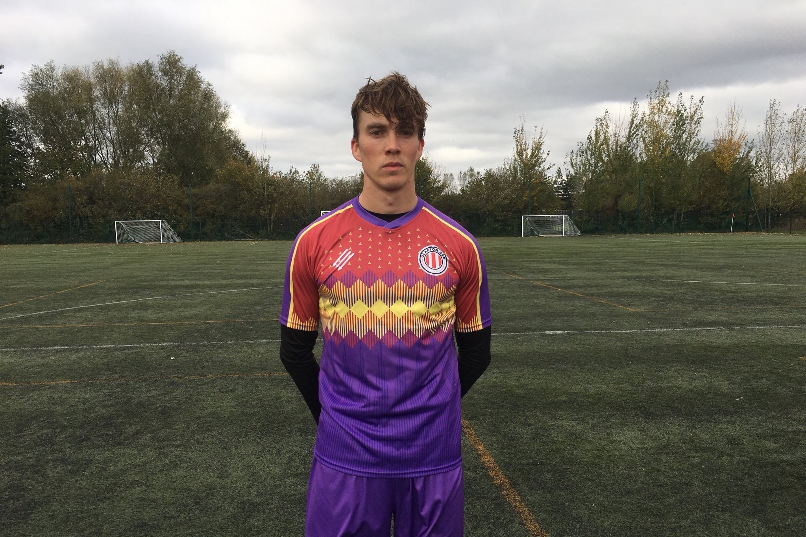
                    </div>
                    <div class="col-sm img-item">
                        
                    </div>
                </div>
            </div>
            ```

The .no-gutters class gives a greater gallery feel by removing any spacing between the images on all screen layouts. The images 
themselves use the .w-100 class to automatically resize and fit the width of their parent column div.

The same code is used for the galleries on other pages, except that the no-gutters class is not applied, as I want space to appear 
between images when advertising products.

6. Contact forms are consistent with their layout across the site and exist on the 
<a href="https://lbacon17.github.io/louis-bacon-portfolio/shop.html" target="_blank">Shop</a>, 
<a href="https://lbacon17.github.io/louis-bacon-portfolio/tutoring.html" target="_blank">Tutoring</a>, 
<a href="https://lbacon17.github.io/louis-bacon-portfolio/fitness.html" target="_blank">Fitness</a> and 
<a href="https://lbacon17.github.io/louis-bacon-portfolio/contact.html" target="_blank">Contact</a> pages. Certain elements are 
introduced or removed to fit the user's needs. Each contact form is in a parent container of a fixed width of 70% so that it does not 
occupy too much of the screen and increase the difficulty of reading it. All input elements have required attributes so an incomplete 
form cannot be submitted. All forms contain fname, lname and email fields, and are housed by a `<div>` element using the .contact-form 
class. Here is an example:

            ```
            <form method="post" class="contact">
                <div class="form-group row">
                    <label for="fname" class="col-sm-3 col-form-label">
                        First Name&#58;
                    </label>
                    <div class="col-sm">
                        <input
                        type="text"
                        class="form-control"
                        placeholder="First name"
                        required
                        />
                    </div>
                </div>
                <div class="form-group row">
                    <label for="lname" class="col-sm-3 col-form-label">
                        Last Name&#58;
                    </label>
                    <div class="col-sm">
                        <input
                        type="text"
                        class="form-control"
                        placeholder="Last name"
                        required
                        />
                    </div>
                </div>
                <div class="form-group row">
                    <label for="email" class="col-sm-3 col-form-label">
                        E-mail address&#58;
                    </label>
                    <div class="col-sm">
                        <input
                        type="text"
                        name="email"
                        class="form-control"
                        placeholder="Your email address"
                        required
                        />
                    </div>
                </div>
                <div class="form-group row">
                    <label for="message" class="col-sm-3 col-form-label">
                        Message&#58;
                    </label>
                    <div class="col-sm">
                        <textarea
                        rows="5"
                        name="projectsummary"
                        id="projectsummary"
                        class="form-control"
                        placeholder="Type your message here"
                        required
                        >
                        </textarea>
                    </div>
                </div>
                <div class="submit-button row">
                    <div class="d-none d-sm-inline col-sm-3"></div>
                    <div class="col-sm">
                        <button type="submit" class="btn btn-success submit-request">
                            Submit&#33;
                        </button>
                    </div>
                </div>
            </form>
            ```

When it comes to the submit button, an empty `<div>` acts as a separate column on sm and above screens so that the button is not 
misaligned with the form. The button should be centred in relation to the input fields above rather than the entire form, which looks 
uncomfortable for the user. On xs screens, the button is on a separate line taking up the full width, so there is no need for an empty 
element, hence the .d-none class.

The tutoring form also incorporates a dropdown menu to enable to user to select their date of birth, and radio and checkbox buttons to 
select various criteria to fit their needs.

            ```
            <div class="form-group row">
                <label
                  for="birthday-dd birthday-mm birthday-yyyy"
                  class="col-sm-3 col-form-label"
                  >
                    Date of birth&#42;&#58;
                </label>
                <div class="dob-dropdown col-sm">
                  <select id="birthday-dd" class="dob-select" required>
                    <option selected disabled>DD</option>
                    <option>01</option>
                    <option>02</option>
                    <option>03</option>
                    <option>04</option>
                    <option>05</option>
                    <option>&#8230;</option>
                  </select>
                  <select id="birthday-mm" class="dob-select" required>
                    <option selected disabled>MM</option>
                    <option>Jan</option>
                    <option>Feb</option>
                    <option>Mar</option>
                    <option>Apr</option>
                    <option>May</option>
                  </select>
                  <select id="birthday-yyyy" class="dob-select" required>
                    <option selected disabled>YYYY</option>
                    <option>2020</option>
                    <option>2019</option>
                    <option>2018</option>
                    <option>2017</option>
                    <option>2016</option>
                  </select>
                  <small class="form-text text-muted dob-small">
                    &#42;if a parent seeking lessons for your child, please
                    enter your child&#8217;s DOB
                  </small>
                </div>
            </div>
            <div class="form-group row">
                <label for="subject" class="col-sm-3 col-form-label">
                    <span class="d-none d-md-inline">
                        I &#47; my child would like lessons in
                    </span>
                    <span class="d-inline d-md-none">
                        Subject
                    </span>
                    &#58;
                </label>
                <div class="col-sm tutoring-options">
                  <input
                    type="checkbox"
                    id="mathsenglish"
                    value="mathsenglish"
                  />
                  <label for="mathsenglish">Maths &#47; English</label>
                  <input type="checkbox" id="german" value="german" />
                  <label for="german">German</label>
                </div>
            </div>
            <div class="form-group row">
                <label for="competency" class="col-sm-3 col-form-label">
                    <span class="d-none d-sm-inline">
                        Competency level
                    </span>
                    <span class="d-inline d-sm-none">
                        Level
                    </span>
                    &#58;
                </label>
                <div class="col-sm tutoring-options">
                  <input
                    type="radio"
                    id="beginner"
                    name="competencyOptions"
                    value="option1"
                    required
                  />
                  <label for="beginner" class="competency-level-option">
                    Beginner
                  </label>
                  <br class="d-block d-sm-none" />
                  <input
                    type="radio"
                    id="intermediate"
                    name="competencyOptions"
                    value="option2"
                    required
                  />
                  <label for="intermediate" class="competency-level-option">
                    Intermediate
                  </label>
                  <br class="d-block d-sm-none" />
                  <input
                    type="radio"
                    id="advanced"
                    name="competencyOptions"
                    value="option3"
                    required
                  />
                  <label for="advanced" class="competency-level-option">
                    Advanced
                  </label>
                </div>
            </div>
            <div class="form-group row">
                <label for="competency" class="col-sm-3 col-form-label">
                    Lesson length&#58;
                </label>
                <div class="col-sm tutoring-options">
                  <input
                    type="radio"
                    id="1hr"
                    name="lessonLengthOptions"
                    value="option1"
                    required
                  />
                  <label for="1hr" class="lesson-length-option">
                    1 hour &#40;&#163;25.00&#41;
                  </label>
                  <br class="d-block d-sm-none" />
                  <input
                    type="radio"
                    id="1hr30"
                    name="lessonLengthOptions"
                    value="option2"
                    required
                  />
                  <label for="1hr30" class="lesson-length-option">
                    1.5 hours &#40;&#163;35.00&#41;
                  </label>
                </div>
            </div>
            <div class="form-group row">
                <label for="subject" class="col-sm col-form-label">
                    I would also like a FREE initial 30&#45;minute
                    assessment&#58;
                </label>
                <div class="col-sm tutoring-options">
                  <input type="checkbox" />
                </div>
            </div>
            ```

In some of the `<label>` elements, there were issuses with the text spilling over onto additional lines and breaking the alignment with 
the input fields. To get around this, there is alternative shorter text for smaller screen sizes, with each version wrapped in a 
`<span>` element using either the .d-none .d-sm-inline classes or the .d-inline .d-sm-none classes.

Here are the style rules in full for the contact forms:

            ```
            .contact-form {
                padding: 25px 0;
            }

            .form-group {
                margin-bottom: 1rem;
                text-align: left;
            }

            .form-control {
                padding-left: 2px;
                padding-right: 2px;
                height: 3em;
            }

            .dob-select {
                background-color: silver;
                padding: 5px;
                display: block;
            }

            .dob-small {
                padding-left: 15px;
                padding-top: 5px;
            }

            .tutoring-options {
                padding-top: 7px;
                padding-bottom: 7px;
            }

            .competency-level-option,
            .lesson-length-option {
                padding-right: 7px;
            }

            .submit-button {
                text-align: center;
                padding-top: 15px;
            }

            .submit-request {
                width: 100%;
                font-size: 1.2rem;
            }
            ```

7. Downloadable CV to view my work experience in more detail. The download button has a dark background to differentiate it from submit 
buttons on contact forms, and sits in the centre of the screen directly below my CV on the 
<a href="https://lbacon17.github.io/louis-bacon-portfolio/cv.html" target="_blank">CV</a> page. There is a child anchor element 
using the target="_blank" attribute so that the CV opens in a new tab.

            ```
            <div class="cv-download">
                <button class="btn btn-dark btn-lg">
                    <a href="./assets/images/louis-cv.pdf" target="_blank">
                        Download Print Version
                    </a>
                </button>
            </div>
            ```

/

            ```
            .cv-download {
                text-align: center;
                margin-top: 1.2rem;
                margin-bottom: 1.2rem;
            }

            .cv-download button a {
                color: #ffffff;
            }
            ```

8. Hamburger menu on xs screens giving a collapsible and expandable navbar. This ensures that the nav links are not squashed together 
on xs screens and hard for the user to separate. A click of the hamburger button will expand the main menu with each link on a separate 
line. The arrow on the shop option now points to the right, with the dropdown expanding at an indent so that it is clear the menu items 
under 'Shop' are not part of the main menu. One issue encountered in previewing the website was that the hamburger menu had a blue ring 
just inside its white border after being clicked. To stop this from happening I used the following CSS:

            ```
            .navbar-toggler:focus {
                outline: none;
            }
            ```

The hamburger icon itself was taken from <a href="https://fontawesome.com" target="_blank">Font Awesome</a>.

<strong>Features left to implement</strong>

I plan to implement the following features at a later stage of the project using 
<a href="https://en.wikipedia.org/wiki/JavaScript" target="_blank">JavaScript</a>:

<ul>
    <li>
        An add-to-cart button below the items in the shop. This would be combined with a checkout page and a cart icon in the top right 
        corner. A '1' would appear when an item was added to a cart as on most online retail websites.
    </li>
    <li>
        A more elegant return to top button in the form of an upward-facing arrow that would appear whenver the user scrolled away from 
        the top of the page, and would simply scroll back up
    </li>
    <li>
        The addition of more items to the <a href="https://lbacon17.github.io/louis-bacon-portfolio/shop.html" target="_blank">Shop</a> 
        page that can be browsed using a carousel feature with left and right arrows. There is a framework in 
        <a href="https://getbootstrap.com/" target="_blank">Bootstrap</a> to help implement this
    </li>
    <li>
        A pop-up box to join my mailing list when users load the home page rather than existing as a separate section at the bottom
    </li>
</ul>

## Technologies Used

The project uses the follwing coding languages:

- HTML
- CSS
- JavaScript

The following frameworks/libraries were also used:

- <a href="https://getbootstrap.com" target="_blank">Bootstrap</a> &#8212; for simple layout frameworks and built-in classes such as 
    .container-fluid
- <a href="https://jquery.com/" target="_blank">jQuery</a> &#8212; to simplify DOM manipulation and traversal
- <a href="https://fontawesome.com" target="_blank">Font Awesome</a> &#8212; to enable the display of icons for quotes, payment info 
    and social media links 
- <a href="https://www.jsdelivr.com/" target="_blank">jsDelivr</a> &#8212; for easy open-sourcing

## Testing

The website was tested in Brave Browser using the both Developer Tools and the Viewport Resizer extension. I took screenshots of each 
page using the Full Page Screen Capture extension.

See the screenshots below for the website layout on a Samsung Galaxy S5 (screen width of 360px) as an example:


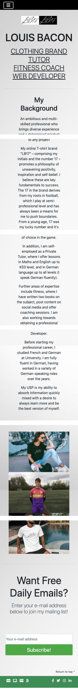


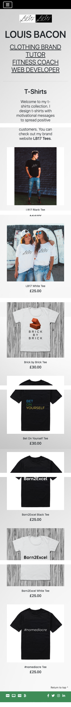

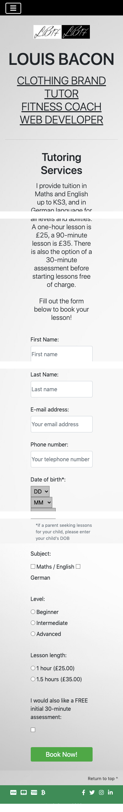


Here are a couple of screenshots of the layout on an iPad (768px width):


Brave Browser is based entirely on Google Chrome and uses the Chrome webstore, so the functionality is exactly as it would be in Chrome. 

I used Developer Tools to test the website layout pixel by pixel as well as on all popular mobile and tablet devices, and the design 
was consistently responsive. The main difference is that the main menu collapses into a hamburger menu on xs sizes with the menu then 
opening downwards rather than across. This pushes down the hero image so that there is no overlay. See the screenshots below.

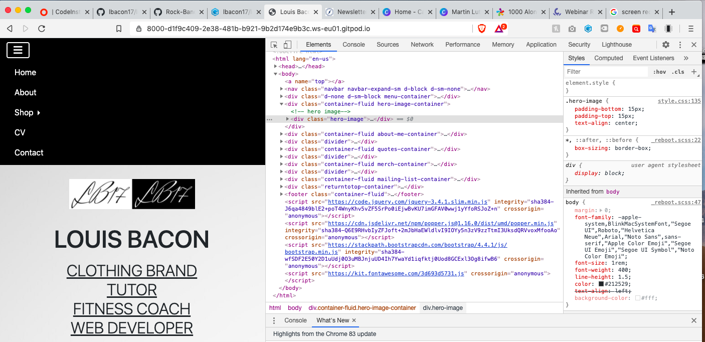


The dropdown menu also works well on tablet and desktop devices, opening just below the main navbar with a deliberate but small amount 
of margin between the edges of each element. This gives a slightly more elegant feel. The dropdown hangs down over the hero image but 
does not obscure any text. See the screenshot below.


Using the Viewport Resizer, I clicked the animate button to test the screen at different sizes on each page, and no layout issues were 
detected.

The width of the input text fields throughout the site adjusts at different screen sizes, but maintains an optimised position in 
relation to any adjacent label text or submit button.

All form elements were tested to ensure that submission is not possible without filling out all the required fields due to the 'required' 
attribute. Here is a screenshot of me attempting to susbcribe to my mailing list without an e-mail address:

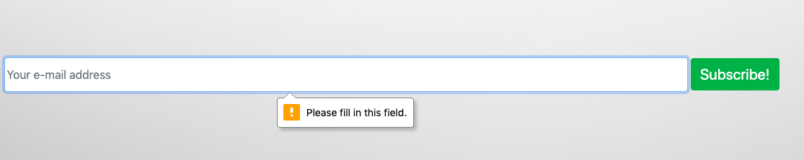

Here are some screenshots of me attempting to submit incomplete contact forms, either with an empty input field or unselected option. 
The code is duplicated for each contact form on the website, so the result would be the same on any page.

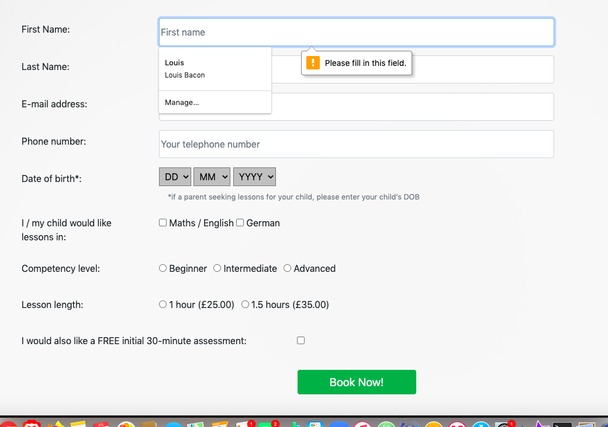
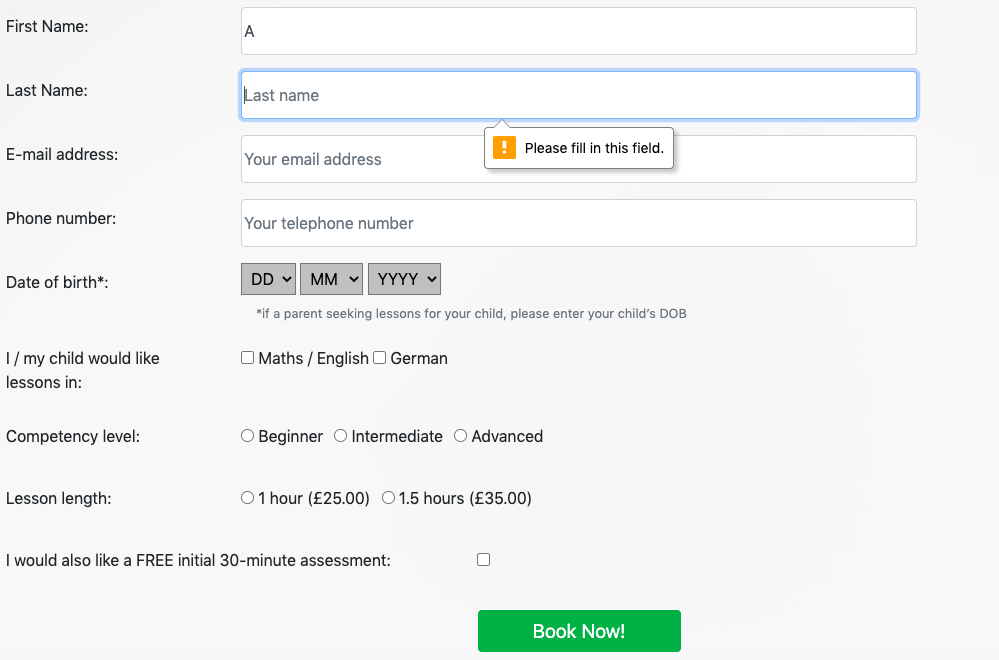
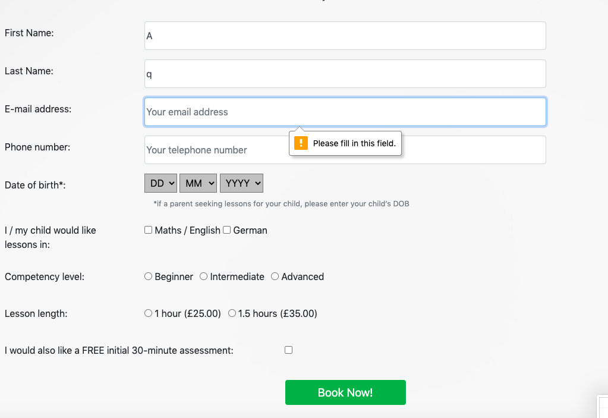
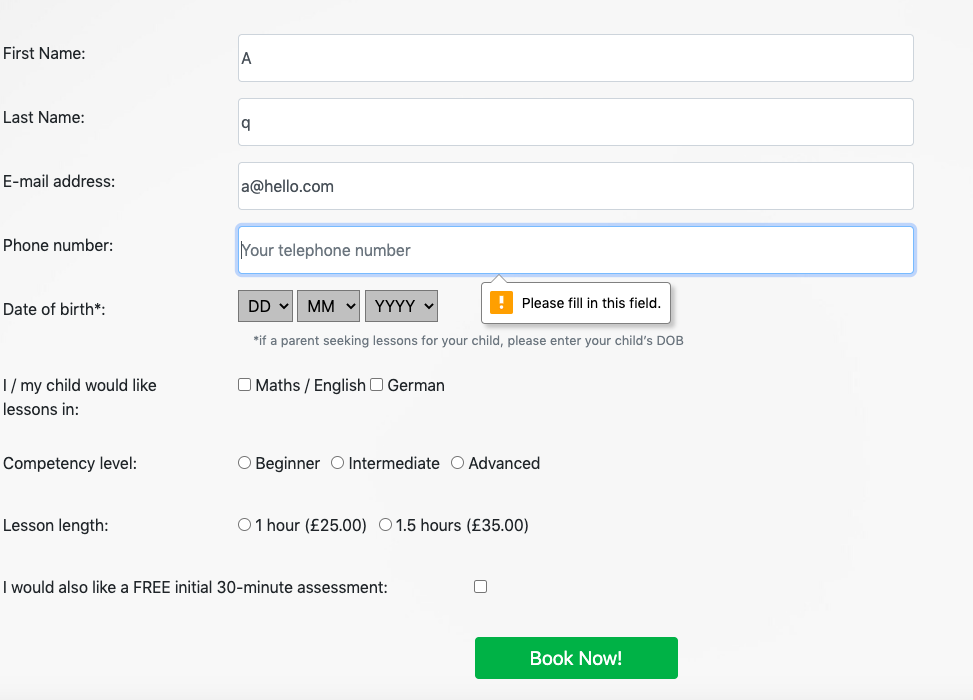
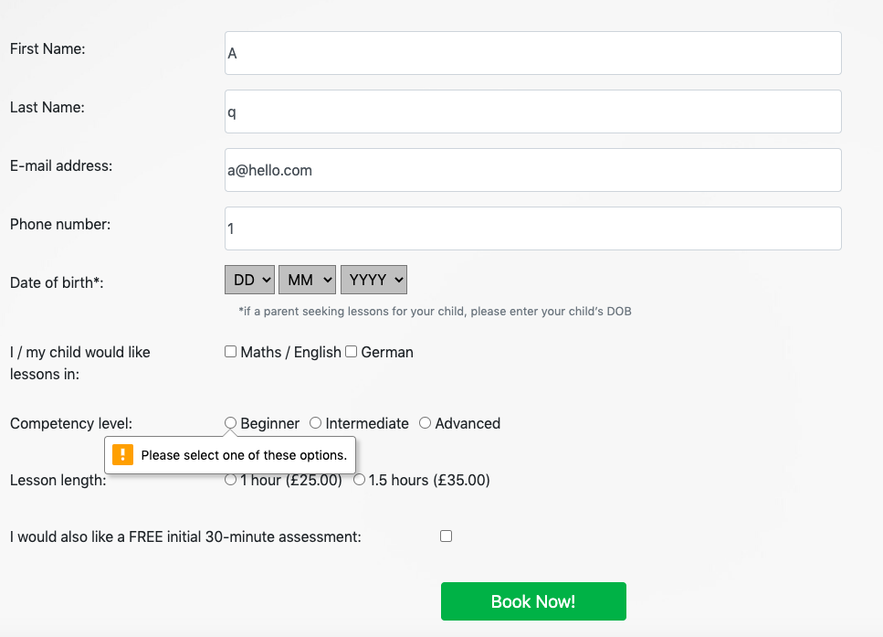
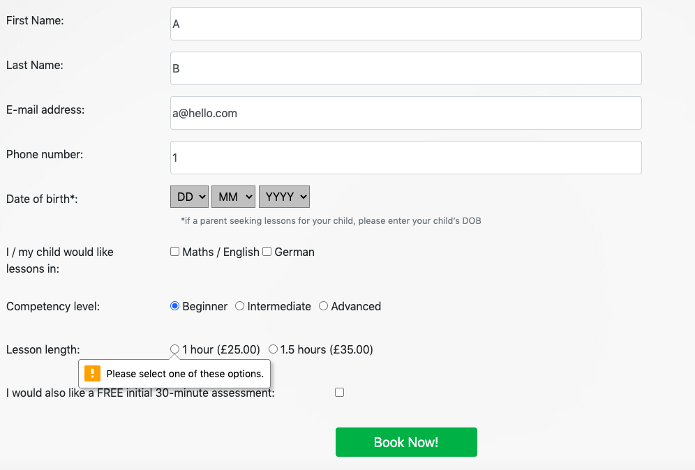

All external links navigate to their intended destination and open in a new browser tab.

<strong>Issues</strong>

The following issues were encountered during the testing phase:

<ul>
<li>
    Dropdown mobile menu initially opened as row before moving to a vertical layout. I discovered this happened because the .navbar-nav 
    class had a rule of 'flex-direction: row'. Removing the style rule resolved the issue.
</li>
<li>
    The border of the hamburger menu displayed a blue ring when selected. To resolve the issue, I added a rule of 'outline: none' to 
    the pseudo class .navbar-toggler:focus
</li>
<li>
    In the mailing list section, the input text field misaligned with the submit button at certain screen sizes, meaning they were not 
    the same width when on different lines or the input field was too narrow when on the same line. This was due to the 'width: auto' 
    rule in the .form-control class. After many unsuccessful attempts to fix the issue, I finally managed to resolve it by giving the 
    element a new .email-input class and using the '!important' property to set the width at various screen sizes.
</li>
<li>
    A blue rectangular border surrounded the Shop link when selected in the mobile dropdown menu when using Safari (both on a Mac at a 
    reduced screen size and on an iPhone). I eventually resolved this by adding an 'outline: none' style rule to the a:focus 
    pseudoelement (attempts to target by class or other more specific properties were unsuccessful).
</li>
</ul>

## Deployment

My website was deployed using GitHub Pages from the repository's master branch.

The website uses the GitHub domain. The full address is 
<a href="https://lbacon17.github.io/louis-bacon-portfolio" target="_blank">https://lbacon17.github.io/louis-bacon-portfolio</a>. 
It is not served from any external domain.

The live site was tested on the following Browsers:

<ul>
    <li>Brave Browser</li>
    <li>Google Chrome</li>
    <li>Mozilla Firefox</li>
    <li>Safari</li>
</ul>

No problems were detected on any of them. Here are two screenshots below - the first is the site in Firefox on my laptop, the second 
in Safari on my iPhone 7:


## Credits

<strong>Content</strong>

A number of classes and elements such as the contact forms and buttons are based on 
<a href="https://getbootstrap.com" target="_blank">Bootstrap</a> documentation and design. For layout simplicity, I have followed the 
container > row > col formula as much as possible.

All icons used on the site (hamburger menu, quote symbols, payment info and social media links) were taken from 
<a href="https://fontawesome.com/start/" target="_blank">Font Awesome</a>.

The 'return to top' button feature at the bottom right of the page uses code based on recommendations from
<a href="https://w3schools.com/" target="_blank">W3Schools</a> and <a href="https://stackoverflow.com" target="_blank">Stack Overflow</a>. 
The specific instructions can be found 
<a href="https://stackoverflow.com/questions/32102747/how-to-make-a-back-to-top-button-using-css-and-html-only" target="_blank">here</a>. 

<strong>Media</strong>

Most the images are taken from my own camera roll. The hero image is my clothing brand logo and can be found on my brand 
<a href="https://lb17tees.com" target="_blank">website</a> along with the t-shirt designs and mockups. I have also had the fitness book 
covers professionally designed and these are my own images. They are free to re-use.
<br>
<br>
The images on the <a href="https://lbacon17.github.io/louis-bacon-portfolio/web-services.html" target="_blank">web services</a> page 
are taken from <a href="https://google.com/images" target="_blank">Google Images</a>. The coming soon image initially had a white 
background, and I used an <a href="https://onlinepngtools.com/create-transparent-png" target="_blank">online PNG tool</a> to convert 
this to a transparent background and blend in with the site.

<strong>Acknowledgements</strong>

I took inspiration for layout and styling from the following websites:

<ul>
    <li>
        <a href="https://www.awwwards.com/websites/portfolio/" target="_blank">Awwwards.com (examples of memorable portfolio website 
        designs)</a>
    <li>
        <a href="https://www.shopify.com" target="_blank">Shopify (which also hosts my clothing website)</a>
    </li>
    <li>
        <a href="https://teamzuby.com" target="_blank">Team Zuby</a>
    </li>
    <li>
        <a href="https://www.jamessmithacademy.com/" target="_blank">James Smith Academy</a>
    </li>
</ul>

Thank you for reading.

I hope you enjoy my portfolio website.