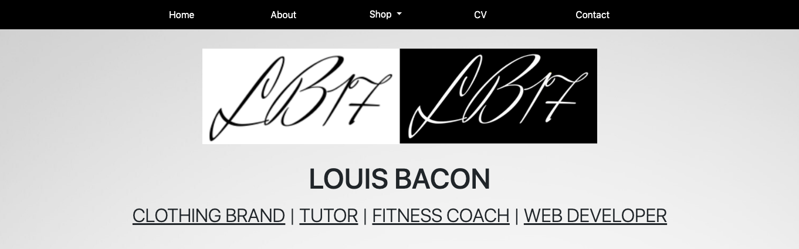

## Louis Bacon Portfolio

Hello,

Welcome to my self-titled portfolio website. 

This website is a hub for me to promote the various products and services that I offer, both as a business and an individual.

I own a clothing brand, provide tuition, write books and guides on fitness and will soon design websites.

The user is immediately aware of this and can intuitively click through the different services to find out more about them.

My website gives an insight into my business and skills, and ensures the user can quickly and painlessly obtain what they need from me.

I have a varied and complex skillset, so a great deal of effort has been made to simplify this.

This website constitutes my First Milestone Project for the Full Stack Developer Course delivered by the <a href="https://codeinstitute.net" target="_blank">Code Institute</a>. 

## UX / design

Simple layout and colour scheme. Dark text on a lighter background, contrasted by a navbar with a dark background and light text. The sea green footer adds some subtle and muted colour to the page without being a shock to the user's eyes.

The menu clearly sets out the different areas of the website making them easy to find.

The footer contains forms of payment on the left side and social media links on the right side. Both are made clear with large enough icons in white (which is very readable against the background colour) and adequate spacing. A copyright notice is placed at the bottom in the centre.

Immediately below my name are clickable links to the different services I offer, taking the user directly to the respective page.

In text areas, the width is limited on larger screens so that the user does not have to read all the way across. No paragraph is more than a few lines long and there is adequate spacing between lines so that information is easily digestible to the reader.

Additionally, font sizes have been carefully chosen to reflect the importance of the text. A larger font with heavier lettering immediately strikes the user so that they know where to read first and immediately understand what a page or section is about.

<strong>Pages</strong>

Home

<ul>
<li>
    My brand logo at the very top of the page. This is the website's hero image.
</li>
<li>
    My name followed immediately by the different services that I provide, each service being a clickable link taking the user to the respective part of the site.
</li>
<li>
    General information about me and what I do, with an invitation to join my mailing list. This takes the user to the final section of the homepage where they can enter their e-mail address and click the susbcribe button to receive regular e-mails from me. The heading was changed from 'About Me' to 'Nice to meet you' as the user would potentially assume the same information was written on the 'about' page with the former title, when in reality the 'about' page describes my story in more depth.
</li>
<li>
    Quotes from past and present clients and associates. Each quote is presented in a separate box with a white background to distinguish it from the site background. The size of the quote icons in relation to the text makes it abundantly clear to the user that this is a quote.
    The third quote disappears on a medium-sized screen as there is not enough screen real estate to incorporate all three in a horizontal format without making the layout look awkward. On small screen sizes and below, quotes are in a vertical layout as they appear more user-friendly in this way. The third quote re-appears on an extra-small screen.
</li>
<li>
    A brief preview of my clothing business with the price of each item clearly shown. Each image is a clickable link that will take the user to the merchandise page (<a href="merch.html">merch.html</a>) where they can look at all my clothing products. It was not practical to incorporate my other services into this section where they are acquired via a sign-up form, but the user has already been made aware of their existence at the top of the site.
</li>
<li>
    Another invitation to join my mailing list by inputting the user's e-mail address and a subscribe button. The input field and button fit nicely together on one line on medium and large screens, and the width of each is adjusted accordingly. This looks clunky on small and extra-small screens, so the code is adjusted to have each on a separate line at equal width, making it a seamless experience for the user. The large, bold heading also immediately catches the users attention, making them more likely to join a mailing list and become a customer.
</li>
<li>
    Each section is separated by a thin horizontal line, using the "divider" class. The spacing between the end of one section and the start of the following is carefully chosen: it is not so close that the text is all on top of each other and makes it a painful experience for the user to read, but not so far away that the user has to guess that more content follows this section.
</li>
</ul>

About

<ul>
    <li>
        More detailed information about me, my background and my story. The story mentions all the areas in which I do business, and each contains a link to its respective page that the user can intuitively navigate to.
    </li>
    <li>
        A small collection of pictures representing some of my work. On the left and right are two t-shirts designed by myself, in the middle is a picture of me at a previous football team (I talk about my experience in the game on this page). The images are not too large so as not to make the user unaware of the presence of more content below, but large enough to catch the user's eye.
    </li>
    <li>
        Another invitation to join my mailing list. The layout is entirely consistent with that of the homepage.
    </li>
</ul>

Shop

<ul>
    <li>
        The Shop link in the navbar has a dropdown menu button where the user can easily see different parts of the shop. The 'All Items' option shows the entirety of the options below. When the user selects the dropdown menu, the page they are on is highlighted by a white background with contrasting text.
    </li>
    <li>
        A gallery of all the t-shirts I have designed with their name and price below the image. To keep the layout simple, there are four images per row with clear spacing between them. The item price is in slightly larger, bolder text so it is immediately clear to the user how much the item costs. On extra smalls screens, there is only one image per row and the t-shirts are set out vertically. This makes it easier for the user to navigate in this screen size.
    </li>
    <li>
        A form for the user to fill out their details when signing up for tutoring lessons. All fields are required so that the user does not submit an incomplete form, and easy to fill out. The screen width of the section is set so that the user never has to read too far across the page, as are the relative widths of the labels and input text fields. On extra-small screens, the label and input fields are on separate lines so that the user can easily locate the input field and fill in the necessary details. The width of the submit button is adjusted so as to fit the entire space on small screen sizes and below, making it easier for the user to locate. The same is true for the date of birth option - although the day, month and year fields fit on the same line on all screen sizes, on extra small devices such as the iPhone 5, where the screen is just 320px wide, they do not. Therefore line breaks have been set to appear at this width, so that the day, month, and year fields are on separate lines. This creates a more seamless user experience.
    </li>
    <li>
        My two fitness books laid out side-by-side, centre-aligned. As with the t-shirts, there is one image per row on an extra small screen, and the name and price appear below the image with the same font size and weighting.
    </li>
    <li>
        An alert box stating that I will offer web services in the future. The two sentences are on separate lines so that the text remains in the centre of the screen and the user does not have to read too far across. On extra-small screens, as the first sentence spans multiple lines, a line-break has been inserted between the two sentences to make the text easier to read.
    </li>
</ul>

Merch

<ul>
    <li>
        All t-shirts displayed in the same layout as the shop page using the same code
    </li>
    <li>
        Brief description of my t-shirt business below the title in lighter text with an invitation to visit my brand's website <a href="https://lb17tees.com" target="_blank">LB17 Tees</a>
</ul>

Tutoring

<ul>
    <li>
        The same form as on the shop page using the same code
    </li>
</ul>

Fitness

<ul>
    <li>
        The same images showing the fitness books as on the shop page, using the same code
    </li>
    <li>
        Information that I also provide coaching sessions with a contact form below for the user to easily fill out. The code and classes used, including media queries at different breakpoints, are exactly the same as that which was used for the tutoring form. The only difference is a details box at the end where the text area has the same classes as the input fields to keep consistency
    </li>
</ul>

Web Services

<ul>
    <li>
        A coming soon logo with under construction emojis either side. The UC emojis are increased in height on extra-large screen sizes so that they are not dwarfed by the middle image. All images decrease at the same rate so that they remain on one line as screen size is decreased except for small screens, where the right-hand side emoji disappears and the left-hand emoji sits on top of the logo and is centred rather than aligned left. This creates a more symmetrical display that is easier on the user's eye.
    </li>
    <li>
        The same alert box as on the home page, with the same code and spacing rules in place.
    </li>
</ul>

CV

<ul>
    <li>
        A Work History section title with Experience and Education in larger headings either side. This immediately informs the user of the information on the page and they can decide whether to look at my education or experience first. That these are in larger font than the work history heading does not cause any confusion to the user it is self-explanatory on a CV page that education and experience columns will be detailing my work history. 
    </li>
    <li>
        My professional experience in the left-hand column, with roles and employers in bullet points and dates in small text above. This clearly differentiates the actual work from the dates to the user.
    </li>
    <li>
        The education column on the right using exactly the same layout to ensure consistency
    </li>
    <li>
        A button to download a PDF of my CV. The link opens in a new window when clicked, so that the user can easily return to my page without losing the CV.
    </li>
</ul>

Contact

<ul>
    <li>
        A couple of lines briefly explaining to the user why contacting me would be necessary or desirable. There is also another invitation to subscribe to my mailing list in case they have questions about news, which will take the user back to the about me page. Initially the mailing list section was replicated below the contact form, but was removed as it did not look pleasing on the eye.
    </li>
    <li>
        A simple contact form using the same layout and rules as the other contact forms. The input fields and button adjust at the same breakpoints and are subject to the same media queries.
    </li>
</ul>

<strong>User Stories</strong>

The aim of the website is to let existing and prospective clients and business partners see what I offer and encourage them to work with me or buy my services.

<ul>
    <li>
        As a student or a parent of a student needing tuition, I want to find out what subjects Louis teaches and his rates. I do this by clicking on the 'tutor' link under his name or opening the 'shop' dropdown menu and selecting 'tuition'. I can then see what subjects he teaches and what his rates are, and book lessons by filling out a simple form.
    </li>
    <li>
        As somebody looking to buy clothes, I click on the 'clothing brand' link or open 'merchandise' under the 'shop' dropdown menu. I can see what products Louis designs and sells, how much they cost and be taken through to his t-shirts website. I would also like to be able to buy directly from this site, which is a planned feature.
    </li>
    <li>
        As somebody looking for advice on fitness, I click on 'fitness coach' or 'fitness' under the 'shop' dropdown menu. I can see the books that Louis has written on the subject and book a coaching session if I wish. I am informed that rates are negotiable and know from the information given that Louis will get back to me. I also have the opportunity to explain my goals and my situation in a bit more detail so that Louis knows what he is working with.
    </li>
    <li>
        I have a brilliant project idea that I think Louis would be great for, but I want to get his view on it first. I head to the contact page by clicking on the 'contact' link on the main menu. I simply fill out the contact form with my details and some information about the project and await Louis' response.
    </li>
    <li>
        I think I'd like to work with Louis on something, but I want to read about his prior experience to check that it's something he's done before. I head to his CV page via the main menu and I can see his work experience. It looks good, but I want to look into it in a bit more detail. I can see there's a download button at the bottom for his full CV, so I click it and a PDF opens. Sure enough, Louis has exactly what I'm looking for, so I'll contact him. Thankfully the CV opened in a new tab, so I don't have to hit the back button and wait for the page to re-load. I go back to Louis' site and navigate from the CV page to the Contact page, fill out the contact form in a few easy steps and await Louis' response.
    </li>
    <li>
        I like Louis' introduction on his homepage, but I want to find out a bit more about him. I click the 'about' link and can read about his story in more detail. If I want to hire him for something or just get in touch, the main menu bar will tell me where to go next.
    </li>
</ul>

## Features

<strong>Features left to implement</strong>

Add to cart button
Return to top button using JavaScript
Carousel using JavaScript to browse store items
A pop-up box to join my mailing list when users load the home page rather than existing as a separate section at the bottom

## Technologies Used

The project uses the follwing coding languages:

- HTML
- CSS
- JavaScript

The following frameworks/libraries were also used:

- Bootstrap
- jQuery
- Font Awesome

## Credits

The following features on the site are based on <a href="https://getbootstrap.com" target="_blank">Bootstrap</a> documentation:

<ul>
<li>The Carousel used for the hero image at the top of the mobile page and for item scrolling on the T-shirts page</li>
<li>Sign-up and contact forms, as well as the e-mail subscription bar</li>
<li>Buttons</li>
</ul>

All icons used on the site were taken from <a href="https://fontawesome.com/start/" target="_blank">Font Awesome</a>.

The 'return to top' button feature at the bottom right of the page uses code based on recommendations from
<a href="https://w3schools.com/" target="_blank">W3Schools</a> and <a href="https://stackoverflow.com" target="_blank">Stack Overflow</a>.

## Styling

## Pages

## Testing

## Deployment

## Issues

Certain issues were encountered in the building phase of the project. These are:

<ul>
<li>Dropdown menu initially showing as row on mobile device before converting to col
</li>
<li>Items in the carousel on the Shop page initially appearing too low when coming onto the screen on a mobile device before moving up
</li>
<li>Carousel items on the Shop page not scrollable on a desktop device</li>
</ul>

We discovered the first issue arose because the .navbar-nav class had a style rule of flex direction: row. Removing this rule resolved the issue.

To run a frontend (HTML, CSS, Javascript only) application in Gitpod, in the terminal, type:

`python3 -m http.server`

A blue button should appear to click: _Make Public_,

Another blue button should appear to click: _Open Browser_.

To run a backend Python file, type `python3 app.py`, if your Python file is named `app.py` of course.

A blue button should appear to click: _Make Public_,

Another blue button should appear to click: _Open Browser_.

In Gitpod you have superuser security privileges by default. Therefore you do not need to use the `sudo` (superuser do) command in the bash terminal in any of the backend lessons.

## Updates Since The Instructional Video

We continually tweak and adjust this template to help give you the best experience. Here are the updates since the original video was made:

**April 16 2020:** The template now automatically installs MySQL instead of relying on the Gitpod MySQL image. The message about a Python linter not being installed has been dealt with, and the set-up files are now hidden in the Gitpod file explorer.

**April 13 2020:** Added the _Prettier_ code beautifier extension instead of the code formatter built-in to Gitpod.

**February 2020:** The initialisation files now _do not_ auto-delete. They will remain in your project. You can safely ignore them. They just make sure that your workspace is configured correctly each time you open it. It will also prevent the Gitpod configuration popup from appearing.

**December 2019:** Added Eventyret's Bootstrap 4 extension. Type `!bscdn` in a HTML file to add the Bootstrap boilerplate. Check out the <a href="https://github.com/Eventyret/vscode-bcdn" target="_blank">README.md file at the official repo</a> for more options.

## Images

Some images from <a href="https://google.com/images" target="_blank">Google Images</a>.

Other images are logos, designs and mockups from my t-shirts website, <a href="https://lb17tees.com" target="_blank">LB17 Tees</a>.

---

Happy coding!
