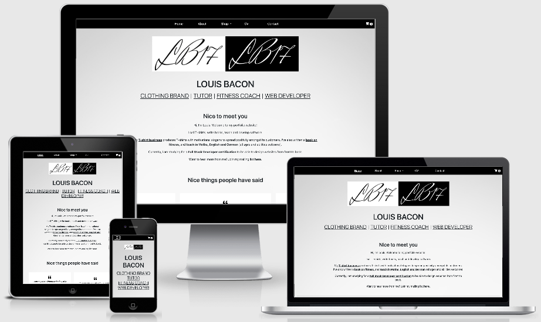

## Louis Bacon Portfolio

Hello,

Welcome to my self-titled portfolio website. 

This website is a hub for me to promote the various products and services that I offer, both as a business and an individual.

My website provides an insight into my business and skills, and ensures the user can quickly and painlessly obtain what they need from me.

This website constitutes my Second Milestone Project for the Full Stack Developer Course delivered by the 
[Code Institute](https://codeinstitute.net).

The deployed website can be found [here](https://lbacon17.github.io/louis-bacon-portfolio-2/).

## UX / design

Simple layout and colour scheme. Dark text on a lighter background, contrasted by a navbar with a dark background and light text. The 
sea green footer adds some subtle and muted colour to the page without being a shock to the user's eyes.

Text is centred throughout the website, and width limited on larger screens so that the user does not have to read all the way across. NO paragraph is more than a few lines long and there is adequate spacing between lines so that information is easily digestible to the reader. The outermost div between the header and footer uses the .text-center class to ensure consistent centre alignment of text and provides the most efficient solution.

The website is designed for both current and perspective customers who may be interested in my products or services. I have a varied and complex skillset, and a great deal of effort has gone into simplifying the website and making it as intuitive as possible for the user. I want the user to immediately see the different services that I offer and be able to explore my website as freely as possible, hence the ease of finding and clicking on a link that takes them to the respective page where they can potentially make a purchase or enquiry.

The menu bar clearly lays out the different pages of the website and stays fixed to the top of the page as content on some pages occupies a lot of screen real estate. This saves the user time having to scroll back to the top to access the main menu.

The footer contains forms of payment on the left side and social media links on the right side. Both are made clear with large enough 
icons in white (which is very readable against the background colour) and adequate spacing. A copyright notice is placed at the bottom 
in the centre.

**Pages**

[Home](https://lbacon17.github.io/louis-bacon-portfolio/index.html)

* My brand logo at the very top of the page. This is the website's hero image.

* My name followed immediately by the different services that I provide, each service being a clickable link taking the user to the 
respective part of the site.

* General information about me and what I do, with an invitation to join my mailing list. This takes the user to the final section 
of the homepage where they can enter their e-mail address and click the susbcribe button to receive regular e-mails from me. The 
heading was changed from 'About Me' to 'Nice to meet you' as the user would potentially assume the same information was written on the 
[about](https://lbacon17.github.io/louis-bacon-portfolio/about.html) page with the former title, when in reality the about page 
describes my story in more depth.

* Quotes from past and present clients and associates. Each quote is presented in a separate box with a white background to 
distinguish it from the site background. The size of the quote icons in relation to the text makes it abundantly clear to the user 
that this is a quote. The third quote disappears on a medium-sized screen as there is not enough screen real estate to incorporate 
all three in a horizontal format without making the layout look awkward. On small screen sizes and below, quotes are in a vertical 
layout as they appear more user-friendly in this way. The third quote re-appears on an extra-small screen.

* A brief preview of my clothing business with the price of each item clearly shown. Each image is a clickable link that will take 
the user to the [merchandise](https://lbacon17.github.io/louis-bacon-portfolio/merch.html) page where they can look at all my clothing 
products. It was not practical to incorporate my other services into this section where they are acquired via a sign-up form, but the 
user has already been made aware of their existence at the top of the site.

* Another invitation to join my mailing list by inputting the user's e-mail address and a subscribe button. The input field and 
button fit nicely together on one line on medium and large screens, and the width of each is adjusted accordingly. This looks 
clunky on small and extra-small screens, so the code is adjusted to have each on a separate line at equal width, making it a 
seamless experience for the user. The large, bold heading also immediately catches the users attention, making them more likely to 
join a mailing list and become a customer.

* Each section is separated by a thin horizontal line, using the "divider" class. The spacing between the end of one section and the 
start of the following is carefully chosen: it is not so close that the text is all on top of each other and makes it a painful 
experience for the user to read, but not so far away that the user has to guess that more content follows this section.

[About](https://lbacon17.github.io/louis-bacon-portfolio/about.html)

* More detailed information about me, my background and my story. The story mentions all the areas in which I do business, and each 
contains a link to its respective page that the user can intuitively navigate to.

* A small collection of pictures representing some of my work. On the left and right are two t-shirts designed by myself, in the middle 
is a picture of me at a previous football team (I talk about my experience in the game on this page). The images are not too large so 
as not to make the user unaware of the presence of more content below, but large enough to catch the user's eye.

* Another invitation to join my mailing list. The layout is entirely consistent with that of the 
[homepage](https://lbacon17.github.io/louis-bacon-portfolio/index.html)

[Shop](https://lbacon17.github.io/louis-bacon-portfolio/shop.html)

* The Shop link in the navbar has a dropdown menu button where the user can easily see different parts of the shop. The 'All Items' 
option shows the entirety of the options below. When the user selects the dropdown menu, the page they are on is highlighted by a 
white background with contrasting text.

* A gallery of all the t-shirts I have designed with their name and price below the image. To keep the layout simple, there are four 
images per row with clear spacing between them. The item price is in slightly larger, bolder text so it is immediately clear to the 
user how much the item costs. On extra smalls screens, there is only one image per row and the t-shirts are set out vertically. This 
makes it easier for the user to navigate in this screen size.

* A form for the user to fill out their details when signing up for tutoring lessons. All fields are required so that the user does 
not submit an incomplete form, and easy to fill out. The screen width of the section is set so that the user never has to read too 
far across the page, as are the relative widths of the labels and input text fields. On extra-small screens, the label and input 
fields are on separate lines so that the user can easily locate the input field and fill in the necessary details. The width of the 
submit button is adjusted so as to fit the entire space on small screen sizes and below, making it easier for the user to locate. The 
same is true for the date of birth option - although the day, month and year fields fit on the same line on all screen sizes, on extra 
small devices such as the iPhone 5, where the screen is just 320px wide, they do not. Therefore line breaks have been set to appear at 
this width, so that the day, month, and year fields are on separate lines. This creates a more seamless user experience.

* My two fitness books laid out side-by-side, centre-aligned. As with the t-shirts, there is one image per row on an extra small screen, 
and the name and price appear below the image with the same font size and weighting.

* An alert box stating that I will offer web services in the future. The two sentences are on separate lines so that the text remains 
in the centre of the screen and the user does not have to read too far across. On extra-small screens, as the first sentence spans 
multiple lines, a line-break has been inserted between the two sentences to make the text easier to read.

[Merch](https://lbacon17.github.io/louis-bacon-portfolio/merch.html)

* All t-shirts displayed in the same layout as the [shop](https://lbacon17.github.io/louis-bacon-portfolio/shop.html) page using 
the same code

* Brief description of my t-shirt business below the title in lighter text with an invitation to visit my brand's website 
[LB17 Tees](https://lb17tees.com)

* The image of each item contains a link that will take the user to the same item on my brand's website, where it is purchaseable. 

[Tutoring](https://lbacon17.github.io/louis-bacon-portfolio/tutoring.html)

* The same form as on the shop page using the same code

[Fitness](https://lbacon17.github.io/louis-bacon-portfolio/fitness.html)

* The same images showing the fitness books as on the shop page, using the same code

* Each image contains a link to [Gumroad](http://gumroad.com/), where my books are listed for sale and the user can purchase if they so 
wish

* Information that I also provide coaching sessions with a contact form below for the user to easily fill out. The code and classes 
used, including media queries at different breakpoints, are exactly the same as that which was used for the tutoring form. The only 
difference is a details box at the end where the text area has the same classes as the input fields to keep consistency

[Web Services](https://lbacon17.github.io/louis-bacon-portfolio/web-services.html)

* A coming soon logo with under construction emojis either side. The UC emojis are increased in height on extra-large screen sizes so 
that they are not dwarfed by the middle image. All images decrease at the same rate so that they remain on one line as screen size is 
decreased except for small screens, where the right-hand side emoji disappears and the left-hand emoji sits on top of the logo and is 
centred rather than aligned left. This creates a more symmetrical display that is easier on the user's eye.

* The same alert box as on the main shop page, with the same code and spacing rules in place.

[CV](https://lbacon17.github.io/louis-bacon-portfolio/cv.html)

* A Work History section title with Experience and Education in larger headings either side. This immediately informs the user of the 
information on the page and they can decide whether to look at my education or experience first. That these are in larger font than 
the work history heading does not cause any confusion to the user as it is self-explanatory on a CV page that education and experience 
columns will be detailing my work history. 

* My professional experience in the left-hand column, with roles and employers in bullet points and dates in small text above. This 
clearly differentiates the actual work from the dates to the user. 

* The education column on the right using exactly the same layout to ensure consistency

* A button to download a PDF of my CV. The link opens in a new window when clicked, so that the user can easily return to my page 
without losing the CV.

[Contact](https://lbacon17.github.io/louis-bacon-portfolio/contact.html)

* A couple of lines briefly explaining to the user why contacting me would be necessary or desirable. 
        
* Another invitation to subscribe to my mailing list in case they have questions about news. The link takes the user to the mailing list 
section of the [homepage](https://lbacon17.github.io/louis-bacon-portfolio/index.html), which starts with an anchor element with an 
attribute value of name="mailing-list". I have therefore added '#mailing-list' onto the end of the homepage URL in the href attribute 
to take the user directly to this section and save time having to scroll all the way to the bottom of the page.

* Initially the mailing list section was replicated below the contact form, but was removed as it did not look pleasing on the eye.

* A simple contact form using the same layout and rules as the other contact forms. The input fields and button adjust at the same 
breakpoints and are subject to the same media queries.

[Cart](https://lbacon17.github.io/louis-bacon-portfolio-2/cart.html)

* Clear headings so that the user can easily follow what items and how many of them are in their cart, and keep track of the total price.

* A thumbnail of the item in cart followed by its name in text, then its individual unit price, quantity and total price (if the quantity is 1, the total price matches the individual unit price). The font size of the headings and inner text decreases at various breakpoints for responsive design, allowing all item information to fit on one line. On extra small screen sizes, the item name text disappears and only the image thumbnail remains due to more limited space. To eliminate doubt on the user’s part, the item name will appear if the user hovers over the thumbnail.  

* The total price of the cart at the bottom, which updates immediately when items are added or removed, or increased or decreased.

* The cart is fully interactive as the information/numbers on the page update in real time with each click by the user. The ‘x’ on the left of the page is the remove button, meaning the item disappears from the cart altogether if clicked (even if the quantity is more than 1), and the cart total updates accordingly. The counter in the navbar also updates. The quantity entry has buttons left and right to decrease and increase the quantity respectively. The quantity cannot be decreased below 1 in order to maintain the cart’s logical integrity. On each click to increase and decrease the quantity, the following data change: the quantity value itself, the price column on the right, the cart’s total price at the bottom of the page. The code implemented allows the user to fully interact with the page by adding and removing with a single click, rather than having to go back to original pages and add items again. The user performs an action and receives an immediate response.

* Buttons to check out and continue shopping. Currently the checkout button renders an alert saying “thank you for your purchase” and the cart resets to being empty. The “continue shopping” button takes the user back to the shop page.

* If there are no items in the cart, all the above data is replaced with a simple “Your cart is currently empty” message with a “back to shop” link to continue shopping (again taking the user back to the shop page) immediately below. The checkout button does not appear in this scenario so as not to confuse the user.

* Items in cart are stored in the browser’s local storage so that the cart total is maintained and does not reset to zero when the page is refreshed or left.

**User Stories**

The aim of the website is to let existing and prospective clients and business partners see what I offer and encourage them to work 
with me or buy my services. I want them to be able to interact with my web page and receive as much information as possible without the added effort of back and forth contact.

* As a business, I want to market myself as effectively as possible to internet users and generate more clients and product sales. I therefore advertise my products, services and their pricing as transparently as possible, and present the opportunity to purchase or sign up to a service via my website.

* As someone needing a website designed, I want to quickly be able to see what Louis can offer and access his GitHub profile to check out examples of his work.

* As a student or a parent of a student needing tuition, I want to book lessons by filling out a simple form and receive confirmation once I have done so. This is more reliable than trying to reach him at a contact number or e-mail address when he may be busy and take a while to reply.

* As a person looking to buy clothes I want to see what products Louis designs and sells, how much they cost and make a purchase in just a few clicks. I also want the opportunity to buy more than one of a certain item or remove an item from my basket after changing my mind.

* As a fitness enthusiast looking for some advice or to learn more, I want to see what sort of content Louis has written and purchase some of his work from his website.

* I can also book a coaching session if I wish. I am informed that rates are negotiable and can book sessions by submitting a form in which I can provide information about my goals and situation in more detail so that Louis has what he needs to start working with me.

* I have a brilliant project idea that I think Louis would be great for, but I want to get his view on it first. I simply fill out the contact form with my details and some information about the project and await Louis' response.

* As a potential client of Louis', I'm considering working with him on something but can read about his prior experience on his CV page and compare it to other prospective contractors. 

* As someone looking to hire Louis, I want to look deeper into his professional history by downloading a full version of his CV.

* As someone who wants to find out a bit more about Louis himself, I can read his story in more detail on the About page.

* As someone who's interested in learning more from Louis and wants to hear from him regularly, I can join his mailing list by simply submitting my e-mail address.

**Wireframes**

I created a number of wireframes using [Wireframe.cc](https://wireframe.cc). They can be found as follows:

| Desktop | Mobile | 
| ------- | ------ |
| [Home](./libraries/wireframes/wireframe-home.png) | [Home](./libraries/wireframes/wireframe-mobile-home.png) |
| [About](./libraries/wireframes/wireframe-about.png) | [About](./libraries/wireframes/wireframe-mobile-about.png) |
| [Shop](./libraries/wireframes/wireframe-shop.png) | [Shop](./libraries/wireframes/wireframe-mobile-shop.png) |
| [Merch](./libraries/wireframes/wireframe-merch.png) | [Merch](./libraries/wireframes/wireframe-mobile-merch.png) |
| [Tutoring](./libraries/wireframes/wireframe-tutoring.png) | [Tutoring](./libraries/wireframes/wireframe-mobile-tutoring.png) |
| [Fitness](./libraries/wireframes/wireframe-fitness.png) | [Fitness](./libraries/wireframes/wireframe-mobile-fitness.png) |
| [Web Services](./libraries/wireframes/wireframe-webservices.png) | [Web Services](./libraries/wireframes/wireframe-mobile-webservices.png) |
| [CV](./libraries/wireframes/wireframe-cv.png) | [CV](./libraries/wireframes/wireframe-mobile-cv.png) |
| [Contact](./libraries/wireframes/wireframe-contact.png) | [Contact](./libraries/wireframes/wireframe-mobile-contact.png) |
| [Cart](./libraries/wireframes/wireframe-cart.png) | [Cart](./libraries/wireframes/wireframe-mobile-cart.png) |

Note that these wireframes were designed prior to commencement of the project. During the project some design decisions were changed, therefore some wireframe designs may look slightly different to the finished product.
        
## Features

**New and existing features**

1. A checkout icon and a number showing the total quantity of items in the user's cart on the right of the navigation bar. This updates immediately each time an item is added or removed.

2. A cart page that calculates the total price of each product and its respective quantity, as well as the total price of the cart itself and empties itself (resets to zero) after a purchase has been completed.

3. An add to cart button underneath each item for sale, that generates an alert that an item was added to the user's cart whenever it is clicked. The alert then disappears after a few seconds.

4. A return to top button in the form of a transparent upward facing arrow enclosed in a red circle that appears in the bottom right of the user's screen when they scroll down from the top. This feature replaces the return to top button from the previous version of this website that was made using only HTML and CSS, and was only available if the user scrolled all the way to the bottom of the page.

5. A reCAPTCHA validation tool that uses Google's API and forces the user to verify themselves as a genuine human being before they can successfully submit any form on the website.

6. An automated confirmation e-mail from EmailJS sent to the user and a separate notification e-mail sent to myself as the website owner whenever the user successfully submits a form.

7. A feature that prevents users including white space in any input fields, e-mail addresses in invalid formats and invalid characters in phone number fields. This makes the forms much more secure.

8. The ability to subscribe to my mailing list by simply entering an e-mail address and hitting the subscribe button.

9. Quote boxes displaying testimonies from clients or other contacts that remain easily readable in all screen sizes.

10. An images gallery that brings to life my story and puts a face to my name, giving the user comfort to know who they are dealing with.

11. Contact forms on multiple pages which differ slightly in content but are consistent in layout and behaviour across the site.

12. A downloadable CV in PDF format to view my work experience in more detail. As the call to action, the download button has a dark background to differentiate it from green submit buttons on contact forms and uses the target="_blank" attribute so that the CV opens in a new tab.

13. A fixed navigation bar that allows the user to easily an intuitively click through the website. An expandable hamburger menu also appears on xs screens so that nav links are too closely bunched together. The fixed position of the navbar saves the user time when they are on a page with large volumes of content and want to exit it without having to scroll back to the top.  They will also see the number in the cart counter increase when adding an item to their cart, meaning they get an immediate response to their action.

14. Services underneath my name as links that navigate to the relevant page, so that the user can jump to these areas quickly should they wish.

15. My brand logo as the website's hero image, so that the user is always aware whose website they are on.

16. A footer containing accepted payment methods and links to my social media, so that the user can visit these if they wish.

**Features left to implement**

I plan to implement the following features at a later stage of the project. 

* A separate checkout page for the user to enter their payment information and finalise their purchase.

* A pop-up box to join my mailing list when users load the home page rather than existing as a separate section at the bottom.

* Automated e-mails for mailing list subscribers notifying them of new content, promotions and special offers.

* The ability to pull up the cart as a dropdown from the top of the page and edit its content without having to leave the active page.

## Technologies Used

The project uses the follwing coding languages:

* HTML
* CSS
* JavaScript

The following frameworks/libraries were also used:

* [Bootstrap](https://getbootstrap.com) &#8212; for simple layout frameworks and built-in CSS classes
* [jQuery](https://jquery.com) &#8212; to simplify DOM manipulation and traversal
* [Font Awesome](https://fontawesome.com) &#8212; to enable the display of icons for quotes, payment info 
    and social media links 
* [jsDelivr](https://jsdelivr.com) &#8212; for easy open-sourcing
* [EmailJS](https://emailjs.com) &#8212; for e-mail templates and automated e-mails to be sent upon form submission, as well as enabling Google reCAPTCHA validation
* [Google reCAPTCHA](https://google.com/recaptcha/about/) &#8212; for secure form submission and user verification
* [GitHub](https://github.com/) &#8212; to host the project
* [Gitpod](https://gitpod.io/) &#8212; to build and develop the website
* [Online PNG Tools](https://onlinepngtools.com) &#8212; to give images a transparent background
* [Am I Responsive](https://ami.responsivedesign.is/) &#8212; for screenshots of the website's responsive design

## Testing

The testing process can be seen [here](testing.md).

## Deployment

My website was deployed using GitHub Pages from the repository's master branch.

The website uses the GitHub domain. The full address is 
[https://lbacon17.github.io/louis-bacon-portfolio](https://lbacon17.github.io/louis-bacon-portfolio-2). It is not served from any 
external domain.

To deploy a website using GitHub pages, carry out the following steps:

1. Select 'Settings' from the menu at the top of the project's repository
2. Scroll down to the section titled 'GitHub Pages'
3. In the 'Source' section, click on the left-hand dropdown menu titled 'Select branch' and choose 'master'
4. The page should refresh itself - if this doesn't happen, simply refresh the page manually
5. There should now be an alert with a green background stating "Your site is published at *link*" - this means the website is now deployed

To clone the project from GitHub and run it locally, follow the steps below:

1. At the top of the project's repository just below the menu, click on the 'Code' dropdown button.
2. In the 'Clone' section, make sure that the 'HTTPS' heading is underlined and copy the URL inside the box.
3. Open the Terminal on your device
4. Inside the Terminal, type 'pwd' to display the device's current working directory
5. Type 'git clone' and paste the URL copied from GitHub (note there must be a space between 'clone' and the URL).
6. Press enter
7. The project folder will be inside the directory printed in step 4

## Credits

**Content**

A number of classes and elements such as the contact forms and buttons are based on [Bootstrap](https://getbootstrap.com) documentation 
and design. For layout simplicity, I have followed the container > row > col formula as much as possible.

All icons used on the site (hamburger menu, quote symbols, payment info and social media links) were taken from 
[Font Awesome](https://fontawesome.com).

The JavaScript used for the cart's functionality is designed based on recommendations from a shopping cart tutorial on [YouTube](https://www.youtube.com/watch?v=B20Getj_Zk4).

**Media**

Most the images are taken from my own camera roll. The hero image is my clothing brand logo and can be found on my brand 
[website](https://lb17tees.com) along with the t-shirt designs and mockups. I have also had the fitness book 
covers professionally designed and these are my own images. They are free to re-use.

The images on the [web services](https://lbacon17.github.io/louis-bacon-portfolio/web-services.html) page are taken from 
[Google Images](https://google.com/images). The coming soon image initially had a white background, and I used an 
[online PNG tool](https://onlinepngtools.com/create-transparent-png) to convert this to a transparent background and blend in with 
the site.

**Acknowledgements**

I took inspiration for layout and styling from the following websites:

* [Awwwards.com](https://www.awwwards.com/websites/portfolio/) (examples of memorable portfolio website 
designs)
* [Shopify](https://shopify.com) (which also hosts my clothing website)
* [Team Zuby](https://teamzuby.com)
* [James Smith Academy](https://jamessmithacademy.com)

Thank you for reading.

I hope you enjoy my browsing portfolio website.