# Testing 

## Validators

**HTML**

The HTML code was passed through the [W3](https://validator.w3.org/) validator. One error and a number of warnings were found.

* Home page

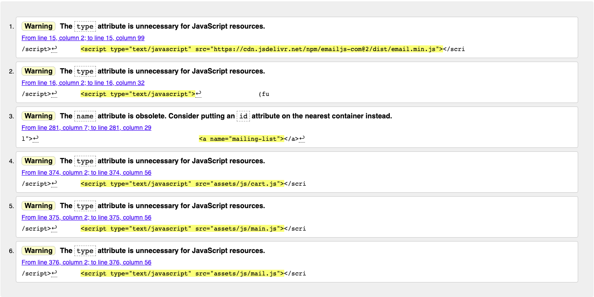

* About page

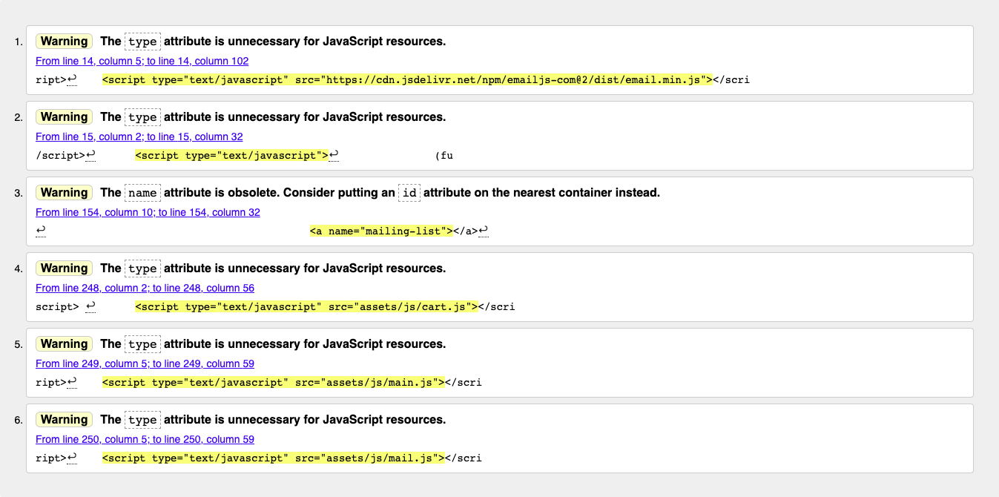

* Shop page

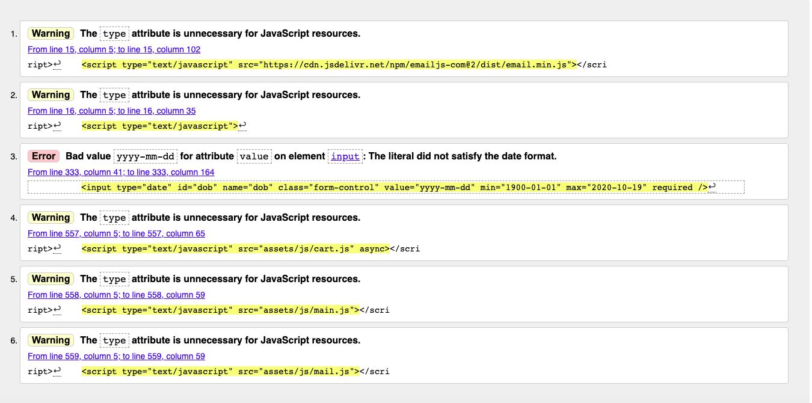

* Merch (T-Shirts) page

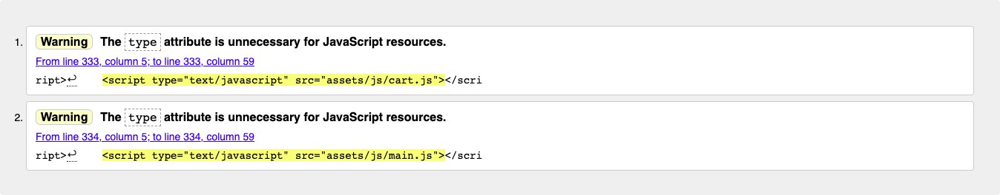

* Tutoring page

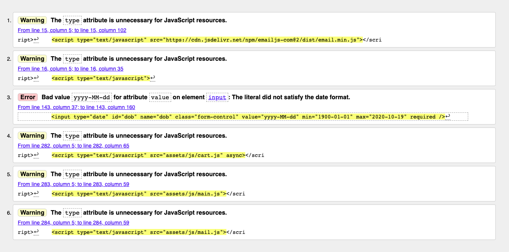

* Fitness page


* Web Services page

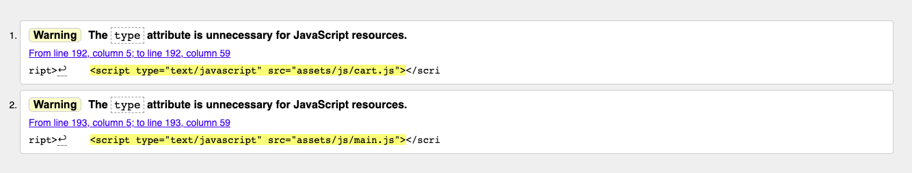

* CV page 

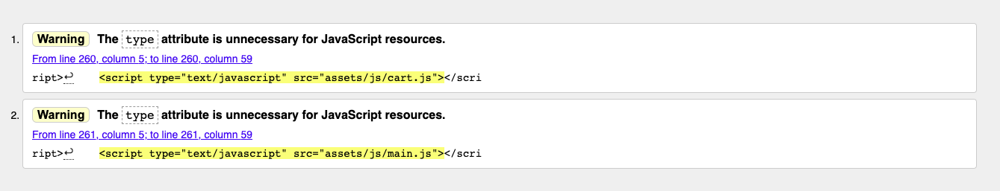

* Contact page 

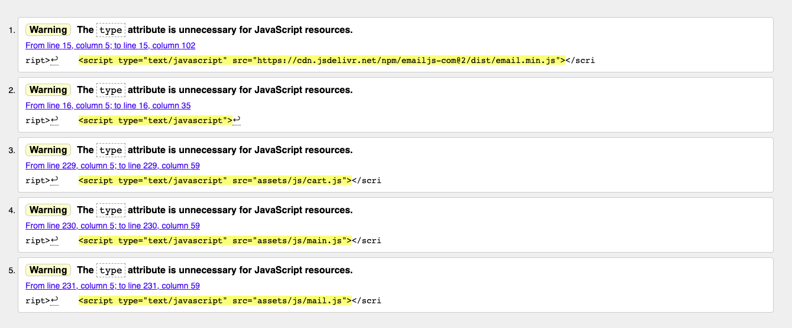

* Cart page 

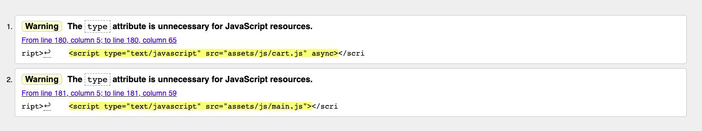

* Additional HTML in JavaScript files that can potentially be run

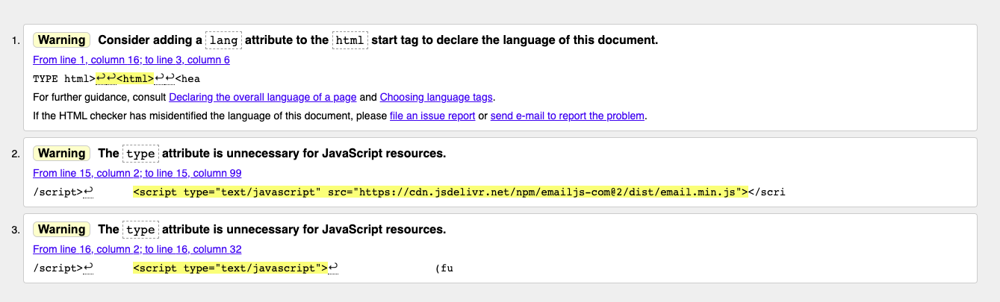

The warnings were ignored as these are design choices and do not affect the performance of the live site.

The error was initially resolved by changing the value attribute on all forms' DOB input fields to null. However during testing it was discovered that Safari does not support the date input type as a browser, meaning the field just appears empty and accepts any input. 

To counteract this, I added a placeholder of 'DD/MM/YYYY' and min/maxlength attributes. This causes another error on the fitness, shop and tutoring pages as the validator states these are not allowed under a date input type. However, as these attributes do not run when the date input type is running on a supported browser, I have decided to leave this error in. This has no effect on the performance of the site.

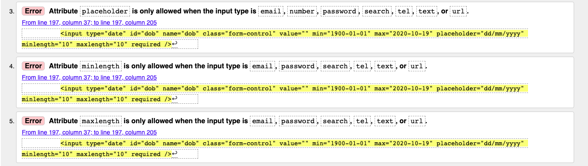

**CSS**

The CSS code was passed through the [Jigsaw](https://jigsaw.w3.org/css-validator/) validator. No errors were found.

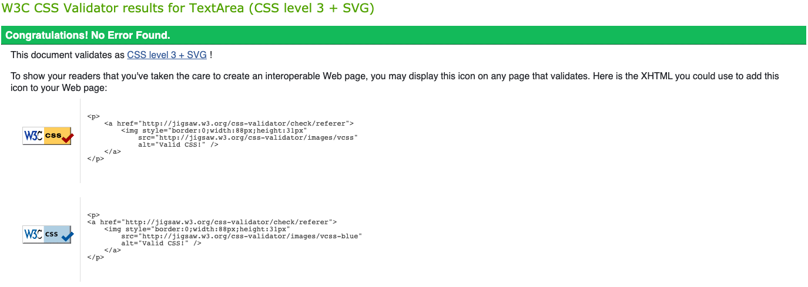

**JavaScript**

The JavaScript code was passed through the [JSHint](https://jshint.com) validator. Several warnings and no errors were found.

* Cart 

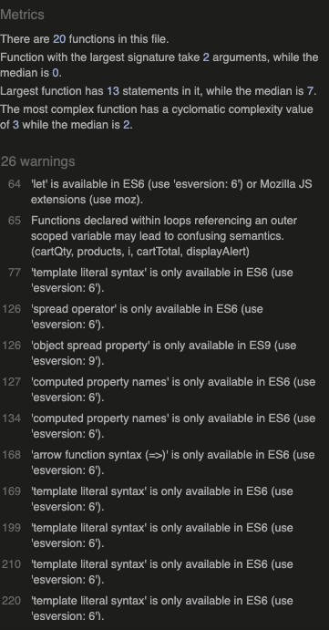
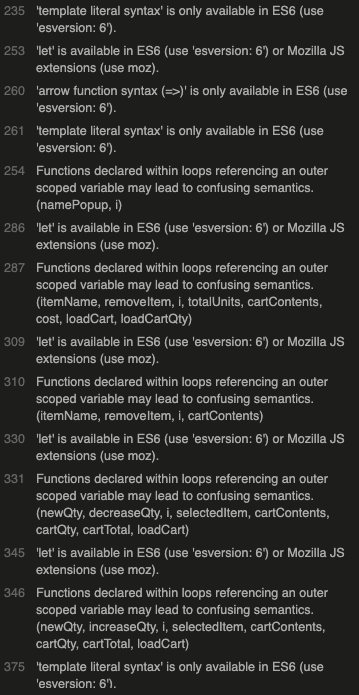
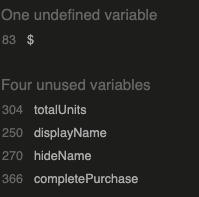

* Main

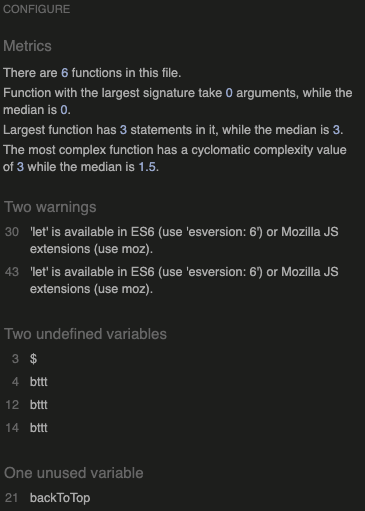

* Mail

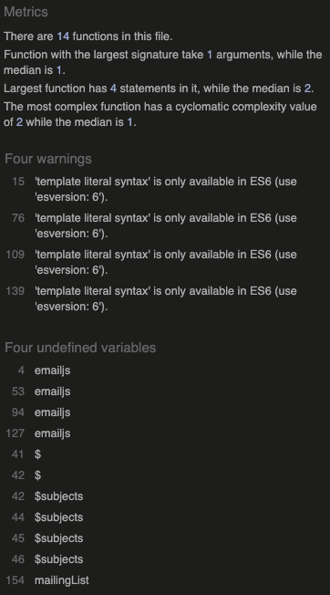

The warnings were ignored as these are design choices and do not affect the performance of the live site.

## Responsiveness

The website was tested in Google Chrome using the [Viewport Resizer](https://bit.ly/2H7B9cY) extension, [Chrome DevTools](https://developers.google.com/web/tools/chrome-devtools) and the [Responsive Design Checker](https://www.responsivedesignchecker.com/checker.php?url=https%3A%2F%2Flbacon17.github.io%2Flouis-bacon-portfolio-2%2F&width=1400&height=700).

The website's layout was tested pixel by pixel and on all popular mobile and tablet devices. The design is consistently responsive at all screen sizes and there is no change in the appearance or performance of interactive features. The only minor issues noted were as follows: 

* the alert boxes generated by potential user actions can appear slightly larger and misaligned on some extra small screens (iPhone 6/7/8 and smaller) due to their text content taking up more lines

* the Google reCAPTCHA box below the contact forms is slightly misaligned with the submit button on 19" desktops and above.

## Browser Compatibility

The website was tested in the following Browsers:

* Google Chrome
* Brave Browser
* Mozilla Firefox
* Safari
* Opera

The website proved good compatibility with all browsers as the functionality and performance was consistent across the board. I observed the following minor issues: 

* the add to cart buttons are surrounded by a thin grey shadow in Mozilla Firefox as if the rest of the page were slightly set back. Nonetheless their position on the page and the clarity of the add to cart icon makes the button functionality clear.

* the date of birth input field in contact forms accepts non-numeric characters in Safari as the browser does not recognise the input type="date" attribute. To address the issue I took the following steps:

1. Added a placeholder attribute with a value of "dd/mm/yyyy" which clearly indicates to the user that they must input a date of birth. This also replicates the appearance in other browsers.

2. Setting a minlength and attribute with a value of 10 characters (including '/'). These attributes will not affect the output in browsers that support the date input type attribute.

3. Added JavaScript to loop through DOB input fields (all of which have an id of "dob") and prevent input of non-numeric keys or forward slashes using the ASCII codes for these characters.

## Testing of User Stories

1. As a business, I want to market myself as effectively as possible to internet users and generate more clients and product sales. I want users to have the opportunity to purchase a product or sign up to a service via my website.

* The user sees the navbar, my brand logo, my name and services as the first things on each page and can intuitively navigate through these.

* When viewing my products, the user sees high-quality thumbnail images, transparent pricing information and a clear add to cart button which triggers a response when clicked. Pricing is calculated automatically for the user once they navigate to the cart page.

* The user encounters several invitations to join my mailing list throughout the website, so I have the chance to sell to them in the future if they provide their e-mail address, even if they choose not to buy immediately.

2. As someone needing a website designed, I want to access Louis' GitHub profile to check out examples of his work.

* The user can click the 'Web Developer' heading under my name or select 'Web Services' from the 'Shop' dropdown menu. They can then read information about my experience and click on the link to my GitHub profile.

* They can also select 'All Items' from the dropdown menu and scroll to the bottom where they will find the same content in the Web Services section.

3. As a student or a parent of a student needing tuition, I want to book lessons via Louis' website rather than try to call him or write to him when he may be busy.

* The user can access the 'Tutoring' page via the dropdown menu or one of the links below my name and fill out their details in the contact form. Once the form is successfully submitted, I will receive a notification that the form has been filled out, while the user receives a confirmation e-mail that their form has been submitted.

* If the user misses the 'Tutoring' section, they can navigate to the 'Contact' page via the main menu and enquire by filling out a similar contact form, where they will also receive a confirmation e-mail. All submitted forms will reach me so I am able to respond to any enquiry as it comes in. 

4. As a person looking to buy clothes I want to see what products Louis designs and sells and purchase them from his website.

* The user can access the 'Merchandise' page via the navbar or the 'Clothing Brand' link. They can see pictures of my products and how much they cost. Clicking the add to cart button gives an instant notification that their item was added and the number in the checkout increases, making the user aware of the response to their action. Due to the fixed navbar, the user will always be able to see how many items are in their cart whilst scrolling.

5. As a potential buyer, I want to be able to buy Louis' products in bulk. If I change my mind on a product, I'd also like to remove it from my shopping list.

* The user can click the add to cart button below an item as many times as they like. Each click adds another unit to the user's cart.

* Once on the cart page, the user can click the + and - icons next to the item to increase or decrease the quantity. They will see the price adjust with each click.

* If the user changes their mind on ordering something, they can click the 'x' on the left of the image thumbnail to remove it from the cart and the cart price adjusts accordingly.

* If the user is not done shopping yet, they can click the 'Continue Shopping' button at the bottom of the cart. Items remain stored in the users cart even if they navigate to another page or leave the website altogether.

* Once the user is happy with their order, they click the 'Checkout' button at the bottom of the cart. Its appearance makes it clearly stand out as the call to action button on the page.

6. As a fitness enthusiast looking for some advice or to learn more, I want to see what sort of content Louis has written and purchase some of his work from his website.

* The user can access the 'Fitness' page via the main menu or the 'Fitness Coach' link. They can see the books I've written on the subject so far with a clear picture of the cover to get a preview of what sort of content to expect.

* Each book has the same add to cart button and pricing information as other products, with the button generating the same alerts and responses.

* Once the user has added these items to their cart, they can navigate to the cart page by clicking the shopping cart icon in the top right corner to complete their purchase.

7. As a person wishing to get in shape, I want to book a coaching session with Louis via his website quickly.

* The user can access the 'Fitness' page via the main menu or the 'Fitness Coach' link and find out information about my coaching and rates before filling out their details in the contact form.

* The user is encouraged to give just a brief description of their goals as asking for too much detail increases the risk of user distraction and an abandoned form. We can go into more detail once I've responded to the user's enquiry and set up an appointment.

* The user receives a confirmation e-mail that their request has been submitted and that I will be in touch as soon as possible, setting the expectation of 24 hours. I am also notified that a request has been submitted.

8. I have a brilliant project idea that I think Louis would be great for, but I want to get his view on it first by contacting him with information about the project and my details.

* The user can click on 'Contact' in the navigation bar and be taken to the contact page to fill out the contact form with their details and some information about the project before awaiting my response.

* Expectations of a response within 24 hours are clearly set, and the user receives an automated confirmation e-mail upon successful submission of their form. I will be alerted to respond to the user as a separate confirmation e-mail is sent to me that a request has come in.

9. As a potential client of Louis', I'm considering working with him on something but want to read about his prior experience and compare it to other prospective contractors. 

* The user can click 'CV' in the navigation bar and be taken to the CV page. They can scroll down to find a timeline of my professional history.

* If they need more detail, they can easily locate the button to download a PDF version below the timeline. The link opens in a new tab so the user can continue to browse my website at the same time, whiel printing or saving my full CV to their device. This enables them to look at my work history without even being on my website, and ensures they have all the time and resources they need to work with me.

* If the user wishes to proceed with a project, they can navigate to the 'Contact' page from the main menu and fill out the contact form.

10. As someone looking to hire Louis, I want to look deeper into his professional history by downloading a full version of his CV.

* as above

11. As someone who wants to find out a bit more about Louis himself, I want to read his story in more detail.

* The user can click on 'About' in the navigation bar to be taken to my About page. They can then read a more detailed biography of my story and find some images of me and my work to put a face to the name. 

* If the user is still curious, there is an invitation to join my mailing list below the images. All they need to do to subscribe is input their valid e-mail address. They will then receive an e-mail thanking them for joining my mailing list, whilst I receive confirmation of a new joiner.

12. As someone who's interested in learning more from Louis and wants to hear from him regularly, I want to subscribe to regular updates and communications from him.

* The user can click the last paragraph of my introduction on the homepage to be taken directly to the mailing list section. They then just need to enter their e-mail address, check the reCAPTCHA box and click subscribe to join. They will then receive a confirmation e-mail that they are now subscribed, and they can look forward to plenty of exciting content. I will also receive an automated e-mail notifying me of a new mailing list subscriber, so that I know to include the user in future e-mails.

## Issues/Bugs

The following issues were encountered during the testing phase:

* Trying to remove an item from the cart returned an error of "cannot read property type of undefined" when trying to access an item's name. I discovered that in accessing the text content of the button's parent div, the browser was also inadvertendly accessing the text content of the screen reader span, meaning the item name was returned twice and therefore not recognised as a product in the cart. I resolved the bug by amending the method to traversing through the sibling elements:

``` 
itemName = removeItem[i].nextElementSibling.nextElementSibling.nextElementSibling.textContent.trim().toLocaleLowerCase().replace(/ /g, "");
```

* The fitness books would appear as the wrong items in the cart if added via the fitness page. This was because they were the only items on this page, meaning the for loop was reading them as the first two items in the products array. The solution to this was twofold:

1. I split the books into a separate array called 'books' which stored their properties.
2. I added further classes to the add to cart buttons, .add-merch for the t-shirts and .add-book for the array, and accessed the buttons via these classes instead of the shared .add-item class when adding to cart. The functions displaying the cart data would then be called with the respective arguments parsed in.

```
var carts = document.querySelectorAll(".add-merch");
var basket = document.querySelectorAll(".add-book");

for (let i = 0; i < carts.length; i++) {
    carts[i].addEventListener("click", function() {
        cartQty(products[i]);
        cartTotal(products[i]);
        displayAlert();
    })
}

for (let i = 0; i < basket.length; i++) {
    basket[i].addEventListener("click", function() {
        cartQty(books[i]);
        cartTotal(books[i]);
        displayAlert();
    })
}
```

* The first item on any page could not be added to the cart more than once - the alert would appear when the button was clicked but the counter would not increase by more than one. This was solved by accessing the data via the button's .add-item class rather than its parent .add-to-cart div.

* If all items were removed from the cart it was still possible for the user to receive an alert thanking them for their purchase if they clicked the checkout button. This was solved by incorporating an if/else statement into the completePurchase() function that would return an error if there were no items in the cart:

```
function completePurchase() {
    var productQty = localStorage.getItem("cartQty");
    var cartContainer = document.querySelector("#products");
    if (productQty > 0) {
        alert ("Thank you for your purchase!");
        document.querySelector("#counter").textContent = 0;
        localStorage.clear();

        cartContainer.innerHTML = "";
        cartContainer.innerHTML = `
            <div class="cart-item-wrapper">
                <h2 class="empty-cart">Your cart is currently empty.</h2>
                <h6 class="back-to-shop-heading">
                    <a href="shop.html" class="back-to-shop-link">Back to shop.</a>
                </h6>
            </div>
        `;
    } else {
        alert ("There are no items in your cart. Please add at least one item to your cart in order to complete your purchase!");
        return false;
    }
}
```

* On the deployed version of the website, the console returns an uncaught typeError (see screenshot below). This refers to the else part of the if/else statement that sets the inner HTML of the cart - if the local storage is empty, the message appears that the cart is empty. I have decided to leave this bug unfixed for the time being as it does not affect the site performance or user experience, while any attempted workarounds caused glitches in the cart page updating, which would have worsened the UX. In future versions of the site, I will seek a solution that resets the cart page's HTML to the same text if the last item is removed from the cart.

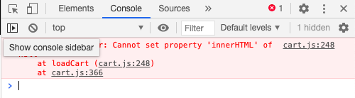

* On the cart page, if there was not enough content the footer was being pushed up from the bottom of page leaving white space at the bottom. This was resolved by taking the following steps:

1. Set the footer's position to absolute and give it a height property with the appropriate value
2. Wrap the entire body in a div and set its position to relative and height to 100vh
3. To avoid overflow from the main body of content into the footer, set the padding-bottom of the div enclosing the main body of content to the equivalent of the footer's height.
4. The footer's height will be different at different screen sizes, so add media queries to ensure it remains at the bottom of the page no matter the screen width 

* On the cart page, if scrolled down from the top, when I clicked on the increase/decrease quantity or remove item icons, the browser would return to the top of the page. Although the action achieved the desired repsonse, it was still frustrating user experience as the user would have to spend time scrolling back down if they wanted to add or remove more items from the cart. I resolved this by removing the href attribute from the anchor tags that enclosed these icons. I then added the cursor: pointer property to the remove-item, decrease-qty and increase-qty classes in the CSS file to ensure the user would have the same response when hovering over the icons.

* The Google reCAPTCHA box would overflow off the edge of the screen on smaller screen sizes and misalign with the call to action button or input fields above it. To solve the issue I targeted the innermost div generated by the Google API whose width is set to 304 pixels. I overrode this attribute by setting the width to 100% and adding the !important property so that the div containing the reCAPTCHA box would always be the same width as its parent div. I also created a number of media queries targeting the rc-container div using the -webkit-transform property to shrink the reCAPTCHA box at smaller screen sizes.

* The Google reCAPTCHA box misaligned with the mailing list form at certain screen sizes. I added the class mailing-list-offset to the RC box's parent div on the relevant pages and gave it a margin-left property.

* There was a similar problem with the reCAPTCHA box below contact forms at larger screen sizes. The box would align centrally to the form itself rather than the submit button immediately above, creating an unnatural staggered appearance. I therefore used the rc-aligner class for the parent div below the various contact forms (not mailing list sign-ups) on the website and added a margin-left property with a different value to that of the mailing-list-offset class.

* The Google reCAPTCHA alert that appears when the user attempts to submit a form without verifying themselves overflowed into the footer at certain screen sizes. This was resolved by giving it a padding-bottom property.

[Back to main README file](README.md).