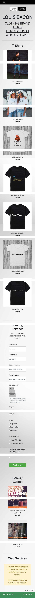
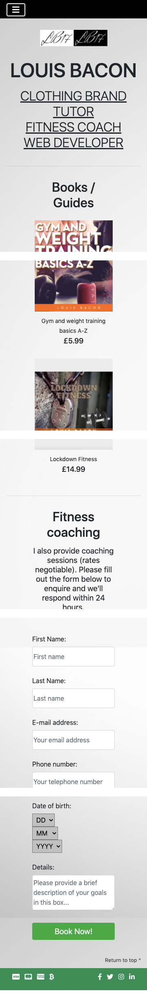
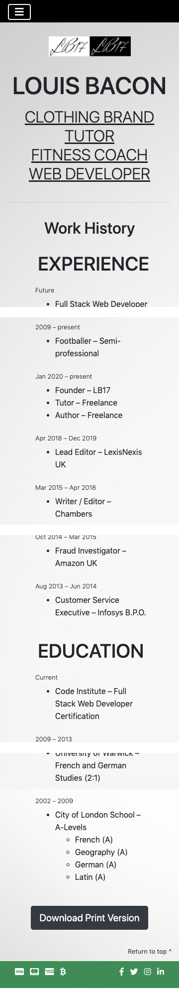
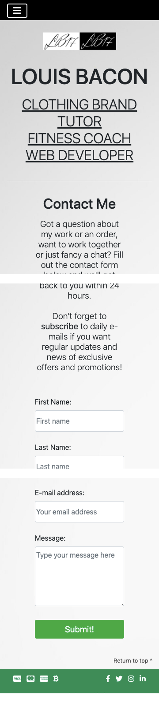

## Validators

**HTML**

The HTML code was passed through the [W3](https://validator.w3.org/) validator. One error and a number of warnings were found.

* Home page


* About page


* Shop page


* Merch (T-Shirts) page


* Tutoring page


* Fitness page


* Web Services page


* CV page 


* Contact page 


* Cart page 


* Additional HTML in JavaScript files that can potentially be run


The warnings were ignored as these are design choices and do not affect the performance of the live site.

The error was resolved by changing the value attribute on all forms' DOB input fields to null.

**CSS**

The CSS code was passed through the [Jigsaw](https://jigsaw.w3.org/css-validator/) validator. No errors were found.


**JavaScript**

The JavaScript code was passed through the [JSHint](https://jshint.com) validator. Several warnings and no errors were found.

* Cart 


* Main


* Mail


The warnings were ignored as these are design choices and do not affect the performance of the live site.

## Responsiveness

The website was tested in Google Chrome using the [Viewport Resizer](https://bit.ly/2H7B9cY) extension, [Chrome DevTools](https://developers.google.com/web/tools/chrome-devtools) and the [Responsive Design Checker](https://www.responsivedesignchecker.com/checker.php?url=https%3A%2F%2Flbacon17.github.io%2Flouis-bacon-portfolio-2%2F&width=1400&height=700).

The website is responsive at all screen sizes and there is no change in the appearance or performance of interactive features. The only minor issue is that the alert boxes generated by potential user actions can appear slightly larger on extra small screens due to their text content taking up more lines.


See the screenshots below for the website layout on a Samsung Galaxy S5 (screen width of 360px) as an example:












Here are a couple of screenshots of the layout on an iPad (768px width):


Brave Browser is based entirely on Google Chrome and uses the Chrome webstore, so the functionality is exactly as it would be in Chrome. 

I used Developer Tools to test the website layout pixel by pixel as well as on all popular mobile and tablet devices, and the design 
was consistently responsive. The main difference is that the main menu collapses into a hamburger menu on xs sizes with the menu then 
opening downwards rather than across. This pushes down the hero image so that there is no overlay. See the screenshots below.


The dropdown menu also works well on tablet and desktop devices, opening just below the main navbar with a deliberate but small amount 
of margin between the edges of each element. This gives a slightly more elegant feel. The dropdown hangs down over the hero image but 
does not obscure any text. See the screenshot below.


Using the Viewport Resizer, I clicked the animate button to test the screen at different sizes on each page, and no layout issues were 
detected.

The width of the input text fields throughout the site adjusts at different screen sizes, but maintains an optimised position in 
relation to any adjacent label text or submit button.

All form elements were tested to ensure that submission is not possible without filling out all the required fields due to the 'required' 
attribute. Here is a screenshot of me attempting to susbcribe to my mailing list without an e-mail address:


Here are some screenshots of me attempting to submit incomplete contact forms, either with an empty input field or unselected option. 
The code is duplicated for each contact form on the website, so the result would be the same on any page.


All external links navigate to their intended destination and open in a new browser tab.

**Issues**

The following issues were encountered during the testing phase:


* Dropdown mobile menu initially opened as row before moving to a vertical layout. I discovered this happened because the .navbar-nav 
class had a rule of 'flex-direction: row'. Removing the style rule resolved the issue.

* The border of the hamburger menu displayed a blue ring when selected. To resolve the issue, I added a rule of 'outline: none' to the 
pseudo class .navbar-toggler:focus

* In the mailing list section, the input text field misaligned with the submit button at certain screen sizes, meaning they were not 
the same width when on different lines or the input field was too narrow when on the same line. This was due to the 'width: auto' rule 
in the .form-control class. After many unsuccessful attempts to fix the issue, I finally managed to resolve it by giving the element a 
new .email-input class and using the '!important' property to set the width at various screen sizes.


* A blue rectangular border surrounded the Shop link when selected in the mobile dropdown menu when using Safari (both on a Mac at a 
reduced screen size and on an iPhone). I eventually resolved this by adding an 'outline: none' style rule to the a:focus pseudoelement 
(attempts to target by class or other more specific properties were unsuccessful).

The live site was tested on the following Browsers:

* Brave Browser
* Google Chrome
* Mozilla Firefox
* Safari

No major problems were detected on any of them. Here are two screenshots below - the first is the site in Firefox on my laptop, the second 
in Safari on my iPhone 7:


There was one minor issue when using Safari, either on a mobile device or on a laptop with the browser window reduced to an xs screen 
size. When selecting 'shop' in the dropdown menu, the element was surrounded by a blue border. I attempted to target the .navbar-toggler 
class and adding the :focus pseudo-class, but this was unsuccessful. I had to target all anchor elements so I added the following rule:

```
a:focus {
    outline: none;
}
```

This successfully prevented the blue border from appearing around the shop link, and did not affect any other elements on the site.

This is the only difference in code between the final developed version and the deployed version.